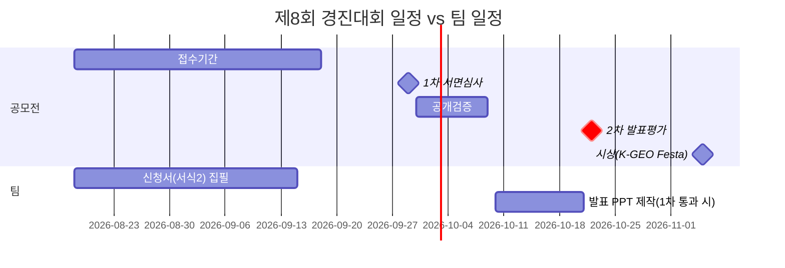

# 01. 공모전 분석 및 수상 전략

> 대상: 「제8회 공간정보 활용·아이디어 경진대회」 (국토교통부 주최 / 공간정보산업진흥원 주관)
> 우리 아이템: 전국 시군구 단위 **"공간 정책 그래프 지도"** — 법령·조례를 노드로, 지역을 노드로 하여 공간 인접성 + 정책 유사성 엣지로 연결하고, 지도 뷰와 그래프 뷰를 연동하는 서비스
> 작성 기준: 공고 원문(브이월드 공지 brdIde=34030) + 첨부 hwp 2종(안내문·제출서류 양식) 전문 판독 + 6·7회 수상작 카드뉴스 전수 판독 결과. 미확인 사항은 "(확인 필요)" 표기.

---

## 1. 공모전 개요

| 항목 | 내용 |
|---|---|
| 공모전명 | 제8회 공간정보 활용·아이디어 경진대회 |
| 주최 / 주관 | 국토교통부 / 공간정보산업진흥원(브이월드 운영기관) |
| 목적 | 공간정보와 다양한 데이터를 융·복합한 우수 활용 사례·아이디어 발굴 → 국민 삶 개선·산업 활성화 |
| 공모 부문 (3개) | ① **공간정보 활용사례** — 국가 공간정보 또는 플랫폼(브이월드, K-GeoP, LXP 등)으로 구현한 앱·웹·프로젝트 ② **공간정보 활용모델(아이디어)** — 정책 제언, 활용서비스 모델 등 ③ **GeoAI 혁신 아이디어** — 국가 공간정보 플랫폼의 AI 활용 모델·서비스 방안 |
| 참가 자격 | 국가 공간정보를 활용하는 개인·기업·기관 등 (사실상 제한 없음). **최대 4인 팀**, 1팀 1작품, 부문 간·부문 내 중복 참여 불가(팀원 일부 겹침도 불가) |
| 접수 | **2026. 8. 18.(화) ~ 9. 18.(금) 23:59** — 이메일 vworld@spacen.or.kr |
| 1차 서면심사 | 9. 29. → 수상 후보작 **9건** 선정 |
| 공개검증 | 9. 30. ~ 10. 9. (특허·논문 검수 + 대국민 온라인 검증 10일 이상, 브이월드·소통혁신24 공개) |
| 2차 발표평가 | **10. 22.** (공간정보산업진흥원 본원=경기 안양시 인근) — 발표 시간·형식은 공고에 없음 (확인 필요) |
| 시상 | 11. 5. 「2026년 K-GEO Festa」 컨퍼런스홀 |
| 시상 규모 | 총 상금 **1,050만원**, 3부문 × 3등급 = 총 9팀. 대상 3건(각 200만원, **국토교통부장관상**) / 최우수상 3건(각 100만원, 진흥원장상) / 우수상 3건(각 50만원, 진흥원장상). "심사기준에 부합하지 않으면 입상작 없을 수 있음" 단서 있음 |
| 제출물 | ① 참가신청서(서식1 표지 + 서식2 본문) ② 참가동의서 ③ 개인정보 동의서(**팀원 전원 개인별**) ④ 수상작 활용 동의서. **1차: hwp 또는 문자인식 가능한 PDF**(스캔본 불가) / **2차: ppt, pdf** |
| 파일명 규칙 | `[공모분야-대표자 성명] 제목` (예: `[GeoAI 혁신 아이디어-하수범] ...`) |
| 분량·서식 제약 | 요약 500자 이내 + **본문 15쪽 이내**(초과분 삭제 처리), 개조식, 여백·글꼴(휴먼명조 15pt/맑은고딕 12pt)·줄간격 140% 임의 변경 금지 |
| 문의 | 진흥원 디지털플랫폼처 031-606-2760 / 2562 |

핵심 일정 리스크: **접수 마감 9.18은 오늘(8.18)부터 딱 1개월**, 발표평가 10.22는 팀 대화대로 **중간고사 기간과 중첩**(팀 내부 판단 기준).

---

## 2. 심사 기준·배점과 우리 아이디어의 득점 매핑

1차는 **서식1+서식2 문서만으로** 평가되고, 서식 작성요령에 "심사기준을 숙지하여 신청서를 작성"이 명기되어 있다. 즉 신청서의 모든 문단이 아래 6개 항목 중 하나에 복무해야 한다.

### 2-1. 1차 서면심사 (100점)

| 기준 | 배점 | 세부기준 | 우리 득점 논리 |
|---|---|---|---|
| 독창성 | 15 | 아이디어·접근방법의 새로움 | 법령·조례를 "목록"이 아니라 **그래프(노드-엣지)로 모델링해 지도와 연동**한 국내 서비스는 역대 수상작에 없음. 공간 인접성 엣지 + 정책 유사성 엣지의 이중 엣지 구조가 차별점 |
| 혁신성 | 15 | 혁신적 방법·기술 사용 | 그래프 유사도 기반 유사 지역·유사 조례 추천, 그래프 군집화, LLM/AI 에이전트(챗봇) 인터페이스 — 8회 슬로건 "공간정보, AI를 만나다"와 정면으로 정합 |
| 정확성 | 15 | 기술·방법의 정확·효과적 표현 | 법령→조례 연계를 법제처 **공식 Open API 4종(lsDelegated·lsStmd·lnkLsOrd·lnkOrg) 실호출 검증** 완료 — "실측했다"는 사실 자체가 정확성 서술의 근거. 유사도 산식·군집 방법론을 단계별로 도식화 |
| 데이터 다양성 | 15 | 다양한 분야 데이터 융·복합 | 법령·조례(법제처) × 행정경계·공간정보(국가공간정보포털/브이월드) × 국회 의안·발의·표결(열린국회정보) × 인구 등 격자 통계(국토정보플랫폼) — 법률·정치·공간·통계 4개 이질 도메인의 융합 |
| **데이터 수급성** | **20** | 핵심 데이터 확보 용이성 | **최대 배점 항목이자 우리 최강점.** 전 데이터가 무료 공개 API. 위임법령(lsDelegated)·법령체계도(lsStmd: 주차장법 1건→조례 1,056건)·연계목록(lnkLsOrd/lnkOrg) 실호출 완료, 인증키는 이메일 기반 무료 발급. 신청서 데이터 표에 "실호출 검증 완료" 명기 |
| **완성도** | **20** | 신청서 구성·내용의 충실성 | 서식2의 5개 장(배경·구현·활용분야·기대효과·참고문헌)을 심사기준에 1:1 대응시켜 구성, 도표·아키텍처 다이어그램·화면 목업 포함, 출처 전수 기재 |

### 2-2. 2차 발표평가 (100점)

| 기준 | 배점 | 세부기준 | 우리 득점 논리 |
|---|---|---|---|
| 전달성 | 15 | — | "실무자가 조례 하나 만들려고 구글링·전화 돌리는 현실"을 30초 스토리로 오프닝. 지도↔그래프 연동 데모 화면(또는 목업 영상) |
| 효과성 | 15 | 투입 대비 효과·국민 체감 | 조례 입안 시 선례 조사 시간·비용 절감을 정량 추정(서식2 기대효과 장의 정량/정성 구분 요구와 연결) |
| 지속성 | 15 | — | 법제처·국회 API 기반 자동 갱신 파이프라인 → 일회성 분석이 아닌 상시 서비스. 조례는 매년 제·개정되므로 데이터가 계속 신선해짐 |
| 활용성 | 15 | 유사 분야 확장 | 조례→예산·주요업무계획, 정책 카테고리(기후·복지·안전…) 횡단 확장, 연구자·언론·시민 감시 용도 |
| **현실성** | **20** | — | 타깃 사용자(지자체·지방의회 실무자)와 사용 시나리오가 구체적. 전 데이터 공개 API로 실구현 장벽 낮음을 실측으로 입증 |
| **파급성** | **20** | — | 전국 243개 지자체 실무자 전체가 잠재 사용자(지자체 수치는 확인 필요). 수상작 공익 활용 조항과 연결해 "브이월드 대국민 서비스 탑재 가능"을 명시적으로 제안 |

### 2-3. 배점 구조에서 나오는 집필 원칙

- 1차 70점 중 **35점(수급성 20+다양성 15)이 데이터 파트**에 걸려 있다 → 서식2 2장 '활용 데이터' 표(연번/데이터명/설명/출처/무상여부)를 가장 공들일 것.
- **치명 제약: 유료데이터·개인데이터 사용 시 "0점" 처리** → 우리 데이터는 전부 공공 무료라 안전하지만, 신청서에 "전 항목 무상·공개"임을 표로 명시해 심사자가 확인하게 만들 것.
- 아이디어 부문은 **제출된 모든 정보(데이터 등)가 공개·활용 가능**해야 함 → 우리 조건 충족.

---

## 3. 부문 선택 분석

공고는 2부문(아이디어/활용)이 아니라 **3부문**이며 중복 지원이 불가하므로 하나를 골라야 한다.

| 판단 축 | ① 활용사례 | ② 활용모델(아이디어) | ③ GeoAI 혁신 아이디어 |
|---|---|---|---|
| 요구 수준 | 이미 **구현한** 앱·웹·프로젝트 | 정책 제언·서비스 모델 (미구현 가능) | AI 활용 모델·서비스 방안 (미구현 가능) |
| 팀 적합성 | 9.18까지 완성된 서비스 필요 → 중간고사 전 학부생 팀에 부담 과다 | 가능 | 가능. **부문 예시가 "K-GeoP+국가법령정보시스템 연계 AI 분석 서비스", "공간정보 기반 정책 매칭 AI 주거복지 서비스"** — 우리 아이템과 사실상 같은 계열 |
| 경쟁 상대 | 공공기관·기업의 실운영 시스템(한난맵류)과 정면 대결 | 일반 아이디어 전체와 경쟁 | AI 신설 부문(8회 신설로 추정)이라 선례 축적이 적음 |
| 제출물 | 3부문 모두 **동일한 서식2 하나** (부문별 별도 양식 없음) | 동일 | 동일 |

### 권고: **③ GeoAI 혁신 아이디어 부문**

근거:
1. **주최 측이 제시한 부문 예시 2건이 모두 우리와 같은 "법령/정책 × 공간 × AI" 계열**이다. 주최가 원하는 그림을 예시로 못 박아 준 부문에 그 그림의 상위 호환을 내는 것이 정석.
2. 코드 제출 없이 hwp 신청서로 승부 가능 → 중간고사(발표 10.22 중첩)와 접수 1개월이라는 팀 제약에 맞음. 단, 그래프 유사도·추천의 **파일럿 결과(소규모 실데이터 분석 1건)** 는 만들어 넣는 것을 강력 권장 — 6·7회 민간 대상작들은 "아이디어"여도 실데이터 분석으로 구체 수치를 보여줬다.
3. 8회 대회 슬로건이 "공간정보, AI를 만나다"(브이월드 게시물 확인)로, AI 부문이 대회의 간판이다.
4. 차선책은 ② 활용모델: 만약 팀이 AI 요소(추천·챗봇)를 빼고 "정책 제언" 프레임으로 가려면 ②가 맞지만, 우리 산출물(그래프 유사도 추천·군집·에이전트 인터페이스)은 AI가 본질이므로 ③이 자연스럽다.
5. 주의: GeoAI 부문의 정의는 "**국가 공간정보 플랫폼의** AI 활용 모델"이므로, 신청서에서 브이월드/K-GeoP 등 국가 플랫폼과의 접점(배경지도, 3D, 행정경계 데이터, 탑재 시나리오)을 반드시 명시해 부문 정의에서 벗어나 보이지 않게 할 것.

---

## 4. 역대 수상작 전수 목록과 경향 분석

### 4-1. 제7회 (2025) — 시상식 2025-09-25, 킨텍스 (카드뉴스 원문 판독)

| 부문 | 등급 | 팀 | 작품 | 성격 |
|---|---|---|---|---|
| 공공 | 대상(장관상) | 한국환경공단 | 폐자원 에너지화시설 입지 분석 플랫폼(MELT) | 입지 **법령**+시설현황+공간정보 융합, 사회 갈등 해결. 아이디어 |
| 공공 | 최우수 | 국토안전관리원 | 지반침하 위험 지하공간정보 분석 | 6종 지하공간정보 중첩. 활용사례 |
| 공공 | 최우수 | 화성시청 | 공장지역 화재 위험 지도 | 25개 분야 26,742건 데이터 통합. 활용사례 |
| 공공 | 우수 | **연구개발특구진흥재단** | **K-GeoP·KLIC 연계 AI 분석 서비스** | **법령×공간×AI — 우리와 가장 가까운 선행작** (아래 4-4 참조) |
| 공공 | 우수 | 수원시청 | 360° VR+국가지점번호 재난안전 플랫폼 | 활용사례 |
| 민간 | 대상(장관상) | 동국대 | 불법 주정차 집중 관리 대상지역 선정 | 소방 사각지대 중첩분석. 아이디어 |
| 민간 | 최우수 | 하림·단국대·명지대·수원대 연합 | '안기다 버스' 정류장 추천 | AI 추천. 아이디어 |
| 민간 | 최우수 | 올포랜드 | 빈집 활용지수 입지추천 플랫폼 | 브이월드 연동. 아이디어 |
| 민간 | 우수 | **청년이음랩** | **공간정보 기반 정책 매칭 AI 주거복지 서비스** | **정책 큐레이션형 선행작** |
| 민간 | 우수 | GIS Application | AIcon3D 정비사업 검토시스템 | **건축법규** 분석+브이월드 3D. 활용사례 |

### 4-2. 제6회 (2024) — 시상식 2024-11-07, 킨텍스 (카드뉴스 원문 판독)

| 부문 | 등급 | 팀 | 작품 | 성격 |
|---|---|---|---|---|
| 공공 | 대상(장관상) | 한국지역난방공사 | 열수송 안전관리 플랫폼 '한난맵' | K-Geo+브이월드 API. 실구축 |
| 공공 | 최우수 | 국립공원공단 한려해상 | 관리토지 3% 선별 분석 | 위성영상+브이월드. 활용사례 |
| 공공 | 최우수 | 한국수자원공사 | 물환경 메타버스 Meta Eco | 브이월드 3D. 아이디어 |
| 공공 | 우수 | 경기도청 | 지능형교통체계 3차원 분석 플랫폼 | **교통정책 의사결정 지원** |
| 공공 | 우수 | 인천소방본부 | 풍수해 소방 빅데이터 분석 | 활용사례 |
| 민간 | 대상(장관상) | 동덕여대·동국대 연합 | 노인 교차로 맞춤형 신호 시스템 | 중첩분석. 아이디어 |
| 민간 | 최우수 | 서울시립대 | **맞춤형 환경 정책 대응 하이브리드 클러스터링** | **정책 대상지 군집화형 선행작** |
| 민간 | 최우수 | 인하대 | 응급차량 경로 최적화 | 아이디어 |
| 민간 | 우수 | 인하공전 | 생성형 AI GeoChatBot | AI 챗봇. 아이디어 |
| 민간 | 우수 | ICTE·눈데이썬·한국교통연구원 연합 | 도보 내비 '반디로' | 아이디어 |

### 4-3. 제5회(2023) 참고 (언론 보도 기준, 카드뉴스 미확인)

- 민간 대상: DL이앤씨 — 3D 용지보상비 자동 산출(보상 **법령·행정업무** 자동화 성격). 1~4회 수상작 상세는 미확인 (확인 필요).

### 4-4. 경향 분석 → 우리에게 주는 시사점

| 경향 (6·7회 20팀 기준) | 시사점 |
|---|---|
| 안전·재난 해결형 최다 (20팀 중 절반 이상, 대상 4건 중 3건이 안전·갈등 소재) | 우리는 안전 소재가 아니므로 **"사회문제 해결" 서사를 다른 축으로 확보**해야 함 — 지방 행정력 격차, 조례 입안 역량의 지역 불평등, 행정 비효율(예산 낭비) 프레임 |
| 사회적 약자·갈등 프레임이 대상 단골 (노인, 폐기물 입지 갈등, 주거약자 청년) | "인구소멸·재정자립도 낮은 소규모 지자체일수록 조례 입안 인력이 부족 → 우리 도구가 격차를 줄인다"는 약자 프레임 가능 (관련 통계 수치는 확인 필요) |
| AI 결합 급증 (6회 1건 → 7회 4팀 이상), 8회 슬로건 "공간정보, AI를 만나다" | AI는 이제 기본기. AI를 썼다는 사실이 아니라 **그래프 구조 위의 AI**(유사도·군집·추천·에이전트)라는 방법의 고유성으로 승부 |
| 브이월드/국가 플랫폼 활용 명시 팀이 다수 수상 (한난맵, 올포랜드, AIcon3D, 한려해상) | 배경지도·행정경계·3D를 브이월드/국가공간정보포털 기반으로 설계하고 신청서에 명시 (§5-3) |
| 민간(대학생) 수상작은 "아이디어여도 실데이터 분석 → 구체 대상지·수치 도출"까지 수행 | 최소 1개 도메인(예: 주차/기후 조례)에 대해 실제 API 데이터로 유사도·군집 파일럿을 돌려 수치·지도를 신청서에 실을 것 |
| 디지털트윈·3D·메타버스형은 최우수·우수급에 분포, 대상은 문제해결형 | 화려한 뷰보다 "실무자의 문제를 푼다"를 앞세울 것 |

### 4-5. ★ 정책·법령 유사 선행 수상작과 차별화 논리

유사작은 **이미 존재한다**. 심사위원(외부 3+내부 2, 1·2차 동일)이 7회 심사를 했다면 반드시 비교 질문이 나온다. 선제 방어 논리를 신청서에 내장할 것.

| 선행 수상작 | 무엇이 겹치나 | 우리의 차별화 |
|---|---|---|
| **7회 공공 우수 — 연구개발특구진흥재단 "K-GeoP·KLIC 연계 AI 분석 서비스"** | 법령×공간정보×AI 조합 그 자체. GeoAI 부문 예시로도 인용됨 | ① 범위: 도심융합특구 등 **6개 특수구역 한정** vs 우리는 **전국 시군구 전체** ② 대상: 법령의 특례·의무 "조회" vs 우리는 지역 간·조례 간 **관계(그래프)와 유사도** — 조회 도구가 아니라 **비교·추천·군집 도구** ③ 사용자: 특구 내 사업자 vs **지자체·지방의회 실무자** ④ 데이터: 법령+필지 vs 법령+**조례 전수**+발의·표결 이력 |
| 7회 민간 우수 — 청년이음랩 "정책 매칭 AI 주거복지" | "정책 매칭" 개념 | 단일 도메인(주거복지)·개인 대상 매칭 vs 우리는 **전 정책 카테고리 횡단**, 기관(지자체) 대상, 매칭 근거가 그래프 구조 |
| 7회 민간 우수 — AIcon3D | 건축법규 분석 포함 | 법규는 부속 기능 vs 우리는 법령·조례 네트워크가 서비스의 본체 |
| 6회 민간 최우수 — 서울시립대 하이브리드 클러스터링 | "정책 대응을 위한 군집화" 방법론 | 환경 센서·인구 데이터 군집 vs 우리는 **제도(조례) 텍스트·연계 구조의 군집** — 군집 대상 자체가 다름 |
| 5회 DL이앤씨 용지보상 | 법령 기반 행정업무 자동화 | 단일 업무(보상비 산출) 자동화 vs 제도 전반의 지도화 |

**한 줄 차별화 선언(신청서·발표 공용):** "기존 수상작들이 *특정 구역·특정 도메인의 법령 정보를 조회*하게 했다면, 우리는 *전국의 법령·조례와 지역을 하나의 그래프로 엮어 '우리와 비슷한 지역은 어떤 조례를 만들었는가'에 답*한다. 전국 커버리지 × 조례 전수 × 관계 기반 추천 — 이 셋을 동시에 만족하는 선행 수상작은 없다."

또한 팀이 참고한 레퍼런스(korea100, klocal)와 과거 기후변화사업단 제안이 있으므로: 타 공모 동일·유사 작품 입상 시 심사 제외 규정이 있다 → **기후변화사업단 제안이 '입상'했었는지 팀 내 확인 필요** (입상했다면 범위·산출물을 명확히 달리해 유사성 시비 차단). 공개검증(9.30~10.9)에서 대국민 표절 검증이 있으므로 korea100·klocal은 참고문헌 장에 레퍼런스로 정직하게 기재하는 것이 안전.

---

## 5. 수상 전략

### 5-1. 심사위원 관점의 강점 5

| # | 강점 | 어느 배점을 먹나 |
|---|---|---|
| 1 | **데이터 수급성의 실측 입증** — 법제처 Open API 4종(lsDelegated·lsStmd·lnkLsOrd·lnkOrg) 실호출 검증, 주차장법 1건→조례 1,056건 매핑 확인, 전 데이터 무료 공개 | 데이터 수급성 20 + 정확성 15 |
| 2 | **관계(그래프) 모델링의 독창성** — 법령·조례·지역을 노드로, 공간 인접성+정책 유사성 이중 엣지. 역대 수상작에 없는 접근 | 독창성 15 + 혁신성 15 |
| 3 | **명확한 사용자와 페인포인트** — 지자체·지방의회 실무자가 조례 입안 시 선례를 구글링·전화로 찾는 현실을 직접 대체. 정부 예시(GeoAI 부문)와 같은 계열이라 심사자가 즉시 이해 | 현실성 20 + 전달성 15 |
| 4 | **4개 이질 도메인 융합** — 법령·조례(법제처) × 공간(브이월드/국가공간정보포털) × 의안·발의·표결(국회) × 통계(국토정보플랫폼) | 데이터 다양성 15 |
| 5 | **상시 서비스로서의 지속성·파급성** — API 자동 갱신 구조, 전국 지자체 실무자 대상, 수상작 공익 활용(브이월드 탑재) 시나리오 제시 가능 | 지속성 15 + 파급성 20 + 활용성 15 |

### 5-2. 약점·예상 공격 포인트 5와 방어 논리

| # | 예상 공격 | 방어 논리 (신청서에 선제 반영) |
|---|---|---|
| 1 | "7회 연구개발특구진흥재단 작품과 뭐가 다른가?" | §4-5의 4축 차별화(전국 vs 6개 특구 / 관계·추천 vs 조회 / 실무자 vs 사업자 / 조례 전수+표결 이력). 신청서 '우수성·타당성' 절에 비교표로 선제 서술 |
| 2 | "정책 유사성을 어떻게 정량화하나? 유사도가 자의적이지 않나?" | 산식을 명시적으로 정의(조례 텍스트 임베딩 + 상위법 위임 관계 + 카테고리 메타데이터의 결합 — 세부 산식은 기획 확정 필요). 파일럿 결과로 유사도 상위 사례를 제시해 face validity 입증 |
| 3 | "법령-조례 연계 데이터가 전수인가? 누락되면 추천이 틀린다" | 실측에서 확인된 한계를 정직하게 인정: lsStmd 1,056건 vs lnkLsOrd 511건 등 경로별 집계 차이 존재 → **복수 API 합집합 수집 + 조례 본문의 법령 인용(「」) 파싱으로 교차 보완**하는 하이브리드 설계를 명시. 한계를 아는 팀임을 보여주는 것 자체가 방어 |
| 4 | "아이디어일 뿐, 실현 가능한가? (학부생 팀)" | 핵심 파이프라인 전 구간이 공개 API로 실측 완료 + 소규모 파일럿 결과 동봉. "구현 장벽은 데이터가 아니라 시간이며, 데이터 리스크는 이미 소거했다"로 응수 |
| 5 | "표결·발의 정보(정당 속성)가 정치적 논란을 부르지 않나? / 그게 왜 필요한가?" | 용도를 "제정 배경·경과의 맥락 제공"으로 한정하고 평가·서열화 표현 배제. 출처는 열린국회정보 공공 API(공개 데이터)임을 명시. 조례 차원의 지방의회 표결 데이터 수급 가능성은 별도 확인 필요 — 미확보 시 국회 법률 차원으로 한정하는 폴백을 신청서에 함께 적어 리스크 관리 능력을 보임 |

추가 리스크(심사 외): 발표평가 10.22가 중간고사와 겹침 → 발표는 팀 지정 1인이면 되고 대표자가 아니어도 됨(FAQ 확인). **시험 부담이 가장 적은 팀원을 발표자로 지정**하고 10월 초부터 리허설. 질의응답은 전원 참여 가능하므로 참석 가능 인원은 최대한 동행.

### 5-3. V-World(국가 플랫폼) 연계 어필 방법

전제 사실: **브이월드 활용은 필수도 가점도 아니다**(안내문·양식·공지 전문 검색으로 확인). 그러나 주관기관이 브이월드 운영기관이고, 부문 정의가 "국가 공간정보 플랫폼의 AI 활용"이며, 역대 수상작 다수가 국가 플랫폼 활용을 전면에 내세웠다. 따라서 "가점이라서"가 아니라 **부문 정의 충족 + 데이터 수급성 + 파급성 서사**의 3중 근거로 자연스럽게 엮는다.

1. **지도 계층**: 지도 뷰의 배경지도·행정경계를 브이월드 지도 API / 국가공간정보포털 행정경계 데이터로 설계하고, 활용 데이터 표에 출처·무상여부와 함께 명기 (서식2 예시 표에도 국가공간정보포털 행정경계가 예시로 들어가 있음 — 심사자에게 익숙한 항목).
2. **통계 계층**: 지역 노드 속성(인구·고령인구 등)을 국토정보플랫폼(국토지리정보원) 격자 통계로 부여 — 역시 서식2 예시 데이터와 동일 출처.
3. **탑재 시나리오**: 기대효과 장에 "수상작 공익 활용 조항에 따라 브이월드 대국민 서비스의 정책·제도 레이어로 탑재 가능"을 명시 — 주최 측이 가져다 쓸 수 있는 그림을 그려주는 것이 파급성 20점 서사.
4. **부문 정의 방어**: GeoAI 부문 정의("국가 공간정보 플랫폼의 AI 활용 모델")를 신청서 배경 절에서 그대로 인용하고 우리 구조가 그 정의의 구현임을 1문단으로 선언.
5. 주의: 브이월드 API의 구체 엔드포인트·이용조건은 아직 실측하지 않았으므로 신청서에 쓰기 전 확인 필요.

### 5-4. 서식2 목차 ↔ 심사기준 매핑 (집필 설계)

| 서식2 장 | 담을 내용 | 주 타깃 배점 |
|---|---|---|
| 1. 배경 및 개요 | 실무자 페인포인트, 선행작 대비 우수성·타당성(비교표), 부문 정의 정합 | 독창성 15, 현실성(2차 복선) |
| 2. 구현 방법 및 결과 | **활용 데이터 표(출처·무상여부·실호출 검증 명기)**, 그래프 구축 절차, 유사도·군집·추천 방법론, 파일럿 산출물(지도·수치) | 수급성 20 + 다양성 15 + 혁신성 15 + 정확성 15 |
| 3. 활용분야 | 실무자 시나리오, 연구·언론·시민 확장, 타 도메인(예산·업무계획) 확장 | 활용성(2차), 파급성(2차) |
| 4. 기대효과 | 정량(조사 시간·비용 절감 추정) / 정성(행정력 격차 완화) 구분 서술 | 효과성(2차), 완성도 20 |
| 5. 참고문헌 출처 | API 문서, korea100·klocal 레퍼런스, 인용 이미지 출처 전수 | 완성도 20, 공개검증 방어 |

---

## 6. 제출 전 체크리스트

### 6-1. 형식 요건 (하나라도 어기면 감점·삭제 처리)

- [ ] 공모분야 체크: **GeoAI 혁신 아이디어** 1개만 체크 (3택1)
- [ ] 핵심내용(요약) **500자 이내**
- [ ] 본문 **15쪽 이내**, 개조식 — 초과분은 삭제 처리됨
- [ ] 서식 고정값 준수: 좌우여백 20mm·상하 10mm, 줄간격 140%, 휴먼명조 15pt/맑은고딕 12pt — 임의 변경 금지
- [ ] 작성요령 파란색 글씨 삭제
- [ ] 대용량 이미지 축소 후 삽입
- [ ] 파일 형식: hwp 또는 문자인식 가능한 PDF (스캔본 불가)
- [ ] 파일명: `[GeoAI 혁신 아이디어-대표자성명] 제목`
- [ ] 4종 서류 완비: 참가신청서 / 참가동의서(대표 서명) / **개인정보 동의서 팀원 전원 각 1부** / 수상작 활용 동의서(대표 서명)
- [ ] vworld@spacen.or.kr 발송 후 **접수 완료 회신 메일 수신 확인** (필수)
- [ ] 마감: 9. 18.(금) 23:59 — 최소 2~3일 전 제출 목표

### 6-2. 내용 요건

- [ ] 6개 서면심사 기준이 각각 어느 절에서 서술되는지 매핑표로 자체 점검 (§5-4)
- [ ] 활용 데이터 표: 전 항목 출처·**무상여부** 기재, 유료·개인데이터 0건 확인 (위반 시 0점)
- [ ] 아이디어 부문 요건: 제출 정보 전부 공개·활용 가능 상태인지 확인
- [ ] 선행 수상작(특히 7회 연구개발특구진흥재단) 대비 차별화 서술 포함 (§4-5)
- [ ] 파일럿 분석 1건 이상 수록 (실데이터 → 지도/수치)
- [ ] 참고문헌 장에 korea100·klocal 포함 인용 출처 전수 기재 (공개검증 대비)
- [ ] 기대효과: 정량/정성 구분 서술

### 6-3. 팀 내부 확인 사항

- [ ] 과거 기후변화사업단 제안의 **입상 여부** 확인 — 타 대회 동일·유사 작품 수상 이력은 제외·수상취소 사유 (확인 필요)
- [ ] 팀원 4인 확정(나정우 참여 여부) — 접수기간 내에는 재접수로 참가자 변경 가능, 종료 후 불가
- [ ] 팀원 전원이 타 팀으로 본 대회 중복 참여하지 않는지 확인 (일부 겹침도 불가)
- [ ] 발표자 지정(대표자 아니어도 됨) — 중간고사 부담 최소 인원, 10.22 안양 이동 가능자
- [ ] 법제처 Open API 인증키(OC) 자체 발급 — open.law.go.kr 가입 후 신청 (데모용 `OC=test` 의존 금지)
- [ ] 수상 시 신청서·발표자료가 공개됨 — 비식별 처리 필요사항 유무 사전 점검
- [ ] 1차 통과 대비 발표 PPT(2차는 ppt·pdf) 제작 일정 확보: 공개검증 종료(10.9) 직후 착수

---

## 부록: 근거 출처 요약

- 공고 원문: 브이월드 공지 「제8회 공간정보 활용·아이디어 경진대회」 개최 안내 (brdIde=34030, 게시 2026-08-13) — 일정·시상은 본문 삽입 이미지 판독
- 첨부 hwp 2종(안내문·제출서류 양식) 전문 판독 — 심사기준 배점, 서식1·2 구성, 분량·서식 제약, FAQ, 0점 조항
- 6·7회 수상작: 브이월드 미디어소식 카드뉴스(brdIde=31248, 28048) 이미지 전수 판독 + 언론 교차 확인(환경일보, 뉴스핌, S저널 등)
- 법제처 Open API 실측: law.go.kr DRF `lsDelegated`·`lsStmd`·`lnkLsOrd`·`lnkOrg`·`ordin` 실호출 검증 (2026-08-18, 주차장법 기준)
- 미확인 잔여 사항: 2차 발표 시간·형식, 브이월드 API 세부 이용조건, 지방의회 표결 데이터 수급 가능성, 1~4회 수상작, 기후변화사업단 제안 입상 여부 — 본문에 "(확인 필요)"로 표기
