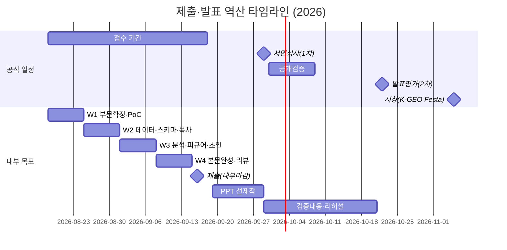

# 06. 실행계획 로드맵 — 제출·발표까지

> 프로젝트: 전국 시군구 「공간 정책 그래프 지도」 (제8회 공간정보 활용·아이디어 경진대회 출품)
> 작성 기준일: 2026-08-18 (접수 시작일 당일)
> 근거: 브이월드 공고(brdIde=34030) 본문·추진일정표 이미지 + 첨부 hwp 2종(안내문·제출서류 양식) 전문 판독 결과

---

## 0. 전제가 되는 사실 확인 (계획의 기반)

| 항목 | 확인 내용 | 상태 |
|---|---|---|
| 발표평가일 | **10.22** — 팀 대화의 "발표심사 10월 22일" 추정이 공식 추진일정표로 확인됨 | 확인됨 |
| 제출 형태 | 1차 서면심사는 **서식1(신청서)+서식2(본문) 문서만으로 평가**. hwp 또는 문자인식 가능한 PDF, 이메일 제출. 팀 대화의 "코드 없이 hwp 양식 제출" 추정과 부합 | 확인됨 |
| 부문 | 3개 부문(활용사례 / 활용모델(아이디어) / GeoAI 혁신 아이디어). 우리 팀은 코드 시연 없이 문서로 승부하는 **활용모델 또는 GeoAI 혁신 아이디어 중 택1** (중복 지원 불가) | 부문 선택은 팀 결정 필요 |
| 분량 제약 | 핵심요약 500자 이내 + **본문 15쪽 이내**(개조식, 글꼴·여백·줄간격 고정, 초과분 삭제 처리) | 확인됨 |
| 데이터 제약 | **개인데이터·유료데이터 사용 시 0점**. 공개 데이터만 사용. 아이디어 부문은 제출 정보 전체가 공개·활용 가능해야 함 | 확인됨 |
| 데이터 실증 | 법제처 국가법령정보 Open API 4개 엔드포인트(lsDelegated/lsStmd/lnkLsOrd/lnkOrg) **실호출 검증 완료** — 법령 조문→전국 개별 조례 매핑 수급 가능 | 확인됨 |
| 2차 발표자료 | 1차 통과 시 **ppt/pdf 별도 제작** 필요. 발표는 팀 지정 1인, 질의응답은 전원 참여 가능 | 확인됨 |

---

## 1. 공모전 핵심 일정 역산 타임라인

### 1.1 공식 일정 (공고 추진일정표 이미지 판독 기준)

| 단계 | 일정 | 비고 |
|---|---|---|
| 공고 | 8.13 ~ 9.11 | |
| **접수** | **8.18(화) ~ 9.18(금) 23:59** | 이메일 vworld@spacen.or.kr. **오늘이 접수 시작일** |
| 서면심사(1차) | 9.29 | 수상 후보작 9건 선정 (외부3+내부2 심사) |
| 공개검증 | 9.30 ~ 10.9 | 표절·중복수상·특허/논문 검수 + 대국민 온라인 검증(10일 이상) |
| **발표평가(2차)** | **10.22** | 공간정보산업진흥원 본원(경기 안양) 인근. 발표 시간·형식은 미공지 (확인 필요) |
| 시상 | 11.5 | 2026 K-GEO Festa 컨퍼런스홀 (장소 상세 확인 필요) |

※ 공고에 "일정·세부내용은 진행상황에 따라 일부 변동 가능" 단서 있음.

### 1.2 역산 마일스톤 (내부 목표)

접수 마감 9.18 23:59에서 역산. 이메일 접수 + 회신 확인이 필요하므로 **내부 마감은 9.16(수)** 로 설정하고 마지막 2일을 버퍼로 남긴다.

| 내부 마일스톤 | 목표일 | 역산 근거 |
|---|---|---|
| M0. 부문 확정 + 4인 여부 확정 + OC 키 발급 | 8.22(토) | 이후 모든 작업의 전제 |
| M1. 데이터 PoC 완료 + 서식2 목차·활용데이터 표 확정 | 8.31(월) | 데이터 수급성 20점 파트가 문서의 뼈대 |
| M2. 분석 결과 3종(추천·인접 군집·유사도 군집) 피규어 확보 | 9.7(월) | 구현결과 장에 들어갈 그림이 있어야 본문 집필 가능 |
| M3. 서식2 본문 15쪽 초안 완성 | 9.10(목) | 리뷰 2회전 시간 확보 |
| M4. 내부 리뷰 2회전 + 서식 규정(글꼴·여백·분량) 검수 완료 | 9.15(화) | |
| **M5. 제출 (파일명 규칙 준수) + 접수 완료 회신 메일 확인** | **9.16(수)** | 마감 이틀 전. 회신 미수신 시 9.17 전화 확인(031-606-2760) |
| M6. 발표 PPT 초안 (1차 결과 전 선제작) | 9.28(월) | 10월 중간고사 충돌 회피용 |
| 1차 결과 확인 → 공개검증 대응 | 9.29~10.9 | 검증 이의 대응 담당자 지정 |
| M7. PPT 완성 + 리허설 2회 | 10.19(월) | 시험 기간 직전·중 부담 최소화 |
| **발표평가** | **10.22(목)** | 안양 이동 소요 반영, 발표자 1인 + 가능 인원 동행 |

---

## 2. 주차별 작업 계획

### 2.1 기본 계획 (문서·피규어 중심 — 아이디어 부문 확정 반영)

1차 심사가 서류만으로 이뤄지므로, **개발은 "문서에 넣을 그림과 수치를 만드는 수준"까지만** 한다. 완성 서비스가 아니라 ①실측된 데이터 표 ②분석 결과 피규어 ③화면 목업이 산출물이다.

| 주차 | 기간 | 목표 | 세부 작업 | 산출물 |
|---|---|---|---|---|
| **W1** | 8.18~8.24 | 의사결정·기반 확보 | 부문 택1(활용모델 vs GeoAI 혁신 아이디어), 4인 여부 확정, law.go.kr OC 키 각자 발급, 역대(6·7회) 수상작 유사작 조사, "두개 MCP" 전제 정정 팀 합의 | 부문 결정 기록, OC 키, 유사작 조사 메모 |
| **W2** | 8.25~8.31 | 데이터 수집 PoC | 시범 카테고리 2개(예: 기후·복지 — 팀 논의 기준) 대상 법령→조례 연계 수집 스크립트(lsStmd+lnkLsOrd 합집합), 시군구 인접성 데이터 확보처 확정(행정경계 — 서식2 예시에 국가공간정보포털 행정경계 언급 있음), 그래프 스키마(노드·엣지·속성) 설계 | 활용 데이터 표(출처·무상여부 포함) 초안, 샘플 데이터셋 |
| **W3** | 9.1~9.7 | 분석·피규어 | 팀 논의 산출물 3종 실계산: ①카테고리별 그래프 유사도 기반 유사 지역+법령 추천 ②지역 인접성 군집 ③법령 유사도 군집. 지도 뷰+그래프 뷰 연동 화면 목업(korea100·klocal UX 레퍼런스 반영) 제작 | 분석 피규어 5~8장, 화면 목업 2~3장 |
| **W4** | 9.8~9.14 | 본문 집필·리뷰 | 서식2 5개 장(배경·개요 / 구현방법·결과 / 활용분야 / 기대효과 / 참고문헌) 집필, 심사기준 6항목 대응 배치, 요약 500자, 리뷰 2회전 | 본문 15쪽 완성본 |
| **W5** | 9.15~9.18 | 제출 | 서식 규정 최종 검수(휴먼명조 15pt·맑은고딕 12pt·줄간격 140%·여백, 파란색 안내문구 삭제, 이미지 용량 축소), 서식1·3·4·5 취합(4는 전원 개별), 9.16 이메일 제출, 회신 확인 | 접수 완료 |
| **W6~7** | 9.19~9.28 | 발표 선준비 | 본문 기반 PPT 초안(1차 결과 나오기 전 제작), 예상 질의 리스트 | PPT 초안 |
| **W8~9** | 9.29~10.9 | 검증 대응 | 1차 결과 확인, 통과 시 공개검증 모니터링·이의 대응, 비식별 처리 필요사항 주관기관 통지 여부 점검 | — |
| **W10~11** | 10.10~10.21 | 발표 준비 | PPT 완성, 리허설 2회(발표자 1인, 질의응답 전원 대비), 시험 일정과 분산 배치 | 발표자료(ppt/pdf) |
| — | 10.22 | **발표평가** | 안양 현장 발표 | — |

### 2.2 대안 일정 (프로토타입 병행 옵션)

여력이 되고 "정확성 15점·완성도 20점"을 더 끌어올리고 싶을 때만 선택. **W3에 실동작 데모(웹 프로토타입)를 추가**하되, 문서 마일스톤(M3·M5)을 침범하면 즉시 중단하고 목업으로 회귀한다.

| 변경점 | 기본 계획 대비 |
|---|---|
| W2 후반 | korean-law-mcp(원격 mcp.gomdori.app/law 검증 완료) 로컬 설치 병행, 챗봇/에이전트 인터페이스 최소 구현 검토 |
| W3 | 화면 목업 대신 지도·그래프 연동 웹 프로토타입(스크린샷 확보 목적). 스크린샷을 본문 '산출물' 절에 실물 근거로 삽입 |
| 손절 기준 | **9.5까지 스크린샷 확보 못 하면 프로토타입 중단**, 목업 경로로 복귀 (본문 초안 9.10 사수) |

---

## 3. 역할 분담안

### 3.1 3인 기본안

| 역할 | 담당 | 주요 책임 |
|---|---|---|
| 팀장 / 데이터·구현 | 하수범 | 전체 일정 관리, API 수집 스크립트·PoC, 프로토타입(옵션), 제출 이메일 발송·회신 확인 |
| 기획 / 집필 | 최희도 | 아이디어 구체화, 서식2 본문 집필 총괄, 레퍼런스(korea100·klocal) UX 분석, 유사 수상작 조사, 서식 규정 검수 |
| 분석 / 발표 | 김민석 | 그래프 유사도·군집 3종 분석, 피규어 제작, PPT 제작, 현장 발표(지정 발표자 1인) |

- 문서는 3인 공동 리뷰(리뷰 2회전: 1회전 내용, 2회전 서식·오탈자).
- 서식4(개인정보 동의서)는 **전원이 개인별로 각각 작성** — 각자 책임.

### 3.2 4인 옵션 (나정우 합류 시)

| 역할 | 담당 | 추가되는 책임 |
|---|---|---|
| 디자인·문서 관리 | 나정우 | 화면 목업, 피규어 시각 품질 통일, 활용 데이터 표 정리, 15쪽 분량·서식 관리, 발표자료 디자인 |

- 최대 4인 팀 가능(공고 확인). **접수기간 내 재접수로 참가자 변경 가능, 접수 종료 후 불가** → 합류 결정은 늦어도 9월 초, 확실히는 W1 내 확정 권장.
- 나정우 미합류 시 나정우 몫은 최희도(문서·표)와 김민석(피규어·디자인)이 분담.

---

## 4. 리스크 관리 표

| # | 리스크 | 영향 | 발생 가능성 | 대응책 |
|---|---|---|---|---|
| R1 | **10월 중간고사와 발표평가(10.22) 충돌** — 팀 대화에서 겹친다고 논의됨. 국민대 중간고사 정확한 기간 (확인 필요) | 발표 준비 부실, 당일 참석 곤란 | 높음 | ① PPT를 1차 결과 전(9.19~9.28)에 선제작 ② 발표자 1인 지정(대표자 아니어도 됨 — 공고 확인)으로 부담 집중 최소화 ③ 리허설을 10.19 이전 배치 ④ 학과 시험 일정 확인 후 필요 시 담당 교수 사전 협의 |
| R2 | **AI 사용량·비용 초과** — 팀 대화에서 크레딧 초과 이슈 이력 있음 | 작업 중단, 개인 비용 부담 | 중 | ① 법령 카테고리 분류는 규칙 기반(키워드·법종구분 코드) 우선, LLM은 보조로만 ② 수집은 LLM 없이 순수 API 배치(lsStmd 법령당 1콜) ③ 결과 캐시·중간산출물 파일 저장으로 재호출 방지 ④ 주간 사용량 점검을 팀장 정례 업무에 포함 |
| R3 | **데이터 규모** — 주차장법 1건에 연계 조례 1,056건(실측). 전국·전 카테고리 확장 시 수집·계산량 급증 | 일정 지연, 분석 미완 | 중 | ① 시범 범위를 카테고리 2개로 한정해 end-to-end 먼저 완성 ② 문서에는 "시범 2개 카테고리 실측 + 전국 확장 로드맵" 구조로 서술(오히려 현실성 20점에 유리) ③ 벌크 수집 시 지연 삽입(공식 쿼터 문서 미확인이므로 예의적 스로틀링) |
| R4 | **발표 준비 시간 부족** | 2차 배점(전달성 15·현실성 20·파급성 20) 손실 | 중 | R1 대응과 동일 + 예상 질의응답 문서를 본문 집필 중 병행 작성(질의응답은 전원 참여 가능하므로 역할 분담) |
| R5 | **역대 수상작 중 유사작 존재** — 팀 우려사항. 타 대회 동일·유사 작품 수상 이력은 심사 제외·수상 취소 사유 | 심사 제외 | 낮~중 | ① W1에 6·7회 수상작 전수 조사 ② 차별점(그래프 구조 + 정책 유사도 + 지도 연동)을 본문 '독창성' 서술에 명시 ③ 과거 기후변화사업단 제출 이력이 "타 공모 입상"에 해당하는지 확인 — 입상하지 않았다면 문제 없으나 사실관계 확인 필요 |
| R6 | **부문 선택 오류** — 중복 지원 불가, 1팀 1작품 | 잘못된 부문에서 경쟁 | 중 | W1 회의에서 결정. GeoAI 부문 예시("K-GeoP+국가법령정보시스템 연계 AI 분석", "공간정보 기반 정책 매칭 AI")가 우리 아이디어와 매우 근접하다는 점, 챗봇/에이전트 인터페이스 논의가 있었던 점을 판단 자료로 사용 |
| R7 | **개인·유료 데이터 혼입 → 0점** | 치명적 감점 | 낮음 | 활용 데이터 표에 전 항목 출처·무상여부 명기(양식 요구사항이기도 함), 법제처 Open API·국가공간정보포털 등 공개 데이터만 사용, 최종 검수 체크리스트에 포함 |
| R8 | **팀원 참여 미정(나정우)** | 역할 공백 | 중 | 3인 기본안으로 계획 수립(본 문서), 합류 시 4인 옵션 가동. 접수 종료(9.18) 후에는 참가자 변경 불가하므로 그 전 확정 |
| R9 | **접수 사고** (파일명 규칙 위반, 회신 메일 미확인, 서식 임의 변경) | 접수 무효·감점 | 낮음 | 내부 마감 9.16으로 버퍼 2일 확보, 제출 체크리스트(5절) 이중 확인, 회신 미수신 시 익일 전화(031-606-2760) |
| R10 | **아이디어 부문 데이터 공개 의무** — 제출된 모든 정보(데이터 등) 공개·활용 가능해야 함 | 요건 미충족 | 낮음 | 공개 API 데이터만 사용하므로 구조적으로 충족. 수상 시 신청서·발표자료가 공개되므로 비식별 처리 필요사항 발생 시 주관기관에 통지(FAQ 절차 확인됨) |

---

## 5. 제출물 체크리스트

### 5.1 1차 제출 (접수 마감 9.18, 내부 마감 9.16)

| 항목 | 요건 | 담당 | 상태 |
|---|---|---|---|
| 서식1 참가신청서 | 부문 3택1 체크, 대표자 정보, 제목, **핵심요약 500자 이내**, 팀원 표 | 최희도(작성) / 하수범(확인) | ☐ |
| 서식2 본문 | 5개 장 구성, **15쪽 이내**, 개조식, 글꼴·여백·줄간격 규정 준수, 파란색 안내문구 삭제, 이미지 축소, 활용 데이터 표(출처·무상여부), 참고문헌 출처 일체 기재 | 최희도(집필) / 김민석(피규어) / 전원(리뷰) | ☐ |
| 서식3 참가 동의서 | 대표 신청인 서명 | 하수범 | ☐ |
| 서식4 개인정보 수집·이용 동의서 | **팀장·팀원 전원 개인별 각각 작성** | 전원 각자 → 하수범 취합 | ☐ |
| 서식5 수상작 활용 동의서 | 대표 신청인 서명 | 하수범 | ☐ |
| 파일 형식 | hwp 또는 문자인식 가능 PDF 원본 (스캔본 불가) | 하수범 | ☐ |
| 파일명 | `[공모분야-대표자 성명] 제목` 형식 | 하수범 | ☐ |
| 제출 | vworld@spacen.or.kr 이메일 발송 | 하수범 | ☐ |
| **접수 완료 회신 메일 확인** | 필수. 미수신 시 031-606-2760 전화 | 하수범 | ☐ |

### 5.2 2차 발표 (1차 통과 시, 10.22)

| 항목 | 요건 | 담당 | 상태 |
|---|---|---|---|
| 발표자료 | **ppt 또는 pdf** (서식3에 명시) | 김민석(제작) / 나정우 합류 시 디자인 | ☐ |
| 발표자 지정 | 팀 지정 1인 (대표자 아니어도 됨) | 김민석 | ☐ |
| 질의응답 준비 | 전원 참여 가능 — 예상 질의 문서 | 전원 | ☐ |
| 현장 이동 | 안양(진흥원 본원 인근), 정확한 장소·시간·발표 형식 (확인 필요 — 1차 통과자 개별 안내 추정) | 하수범 | ☐ |

---

## 6. 즉시 실행할 다음 액션 (8.18 ~ 8.24)

| # | 액션 | 담당 | 기한 |
|---|---|---|---|
| 1 | **첨부 hwp 2종(안내문·제출서류 양식) 전원 정독 후 부문 결정 회의** — 활용모델(아이디어) vs GeoAI 혁신 아이디어 택1. GeoAI 부문 예시가 우리 아이디어와 근접함을 판단 자료로 | 전원 (주재: 최희도) | 8.20 |
| 2 | **나정우 참여 여부 확정** — 접수 종료 후 참가자 변경 불가. 4인 확정 시 역할표 3.2안 가동 | 하수범 | 8.22 |
| 3 | **law.go.kr(open.law.go.kr) 회원가입 + Open API 인증키(OC) 발급** — 각자 1개씩. 발급 즉시 lsDelegated·lsStmd 호출 재현 테스트 | 전원 각자 (검증: 하수범) | 8.21 |
| 4 | **"두개 MCP" 전제 정정 합의** — korea100·klocal에는 사용 가능한 MCP가 없음(검증 완료). 두 사이트는 UX·콘텐츠 레퍼런스로 재정의하고, 법령·조례 접근은 법제처 Open API(+korean-law-mcp 차용)로 한다는 아키텍처 합의를 팀 채팅에 명문화 | 하수범 (최희도 의도 재확인 포함) | 8.19 |
| 5 | **역대(6·7회) 수상작 조사** — 유사작 존재 여부 확인, 차별점 정리 메모 작성. 과거 기후변화사업단 제안의 '타 공모 입상' 해당 여부도 함께 확인 | 최희도 | 8.24 |

보너스(여력 시): 서식2 목차 골격에 심사기준 6항목(독창성/혁신성/정확성/데이터 다양성/데이터 수급성/완성도) 대응표를 붙인 집필 가이드 1쪽 작성 — 담당 최희도, 8.24.

---

## 부록. 배점 대응 요약 (일정 우선순위의 근거)

| 심사 단계 | 고배점 항목 | 본 계획에서의 대응 |
|---|---|---|
| 1차 서면 (100점) | 데이터 수급성 20 + 데이터 다양성 15 | W2 활용 데이터 표에 최다 시간 배정, "공식 API 실호출 검증 완료" 실측 수치(주차장법 기준 연계 조례 1,000여 건) 인용 |
| 1차 서면 | 완성도 20 | 리뷰 2회전(M4), 서식 규정 검수 전담 배치 |
| 2차 발표 (100점) | 현실성 20 + 파급성 20 | 시범 카테고리 실측 → 전국 확장 로드맵 서사, 지자체·지방의회 실무자 시나리오(조례 사전조사 시간·비용 절감) 중심 발표 구성 |
