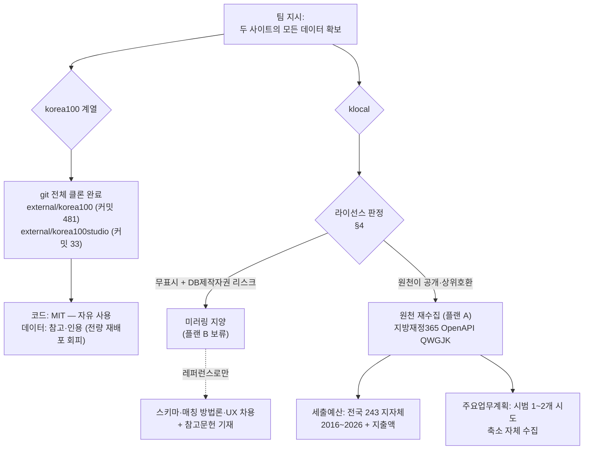
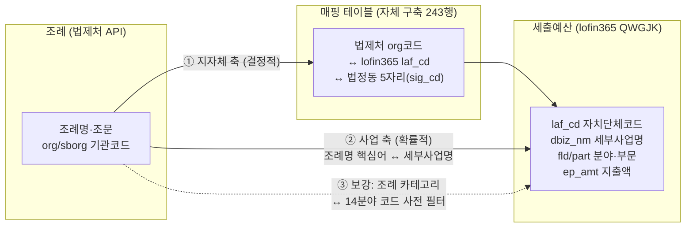

# 08. 데이터 확보 전략 — "두 사이트의 모든 데이터"의 실행 계획

> 문서 목적: 팀 지시 "두 사이트(korea100·klocal)의 모든 데이터를 갖고온다"를 **적법하고 실행 가능한 계획**으로 확정한다. 무엇이 이미 로컬에 있고, 무엇을 어떤 경로로 더 가져오며, 무엇은 가져오면 안 되는지를 한 문서로 못 박는다.
>
> 기준일: 2026-08-18. [실측] = 로컬 파일·라이브 사이트에서 직접 확인, (추정) = 근거 있는 추정, (확인 필요) = 조사자료에 없는 사실.
>
> 연관 문서: [01. 공모전 분석](./01_공모전_분석_및_수상전략.md) · [02. 선행사례 분석](./02_선행사례_및_유사서비스_분석.md) · [03. 데이터소스](./03_법령조례_체계와_데이터소스.md) · [04. 선행연구 리뷰](./04_선행연구_리뷰.md) · [05. 시스템 설계](./05_시스템_설계.md) · [06. 실행계획 로드맵](./06_실행계획_로드맵.md)

---

## 0. 요약 판정 (3줄)

1. **korea100·korea100studio는 이미 전량 확보 완료**(git 전체 클론, 커밋 이력 포함). 코드는 MIT로 자유, **데이터 JSON의 "전량 재배포"만 회피**하고 스키마·방법론 차용 + 참고문헌 인용으로 쓴다.
2. **klocal은 미러링하지 않는다.** 세출예산 축은 원천(지방재정365)이 klocal보다 **상위 호환**(다년·일간 갱신·지출액 포함·이용조건 명시)이라 미러링할 실익 자체가 없고, 라이선스 무표시 + DB제작자권(저작권법 제91~93조) 리스크가 있다. 전량 확보 계획(§2)은 **플랜 B로 문서화만** 해 둔다.
3. 따라서 "모든 데이터를 갖고온다"의 실질적 완수는 **"klocal이 가진 것과 같은 데이터를 원천에서 더 좋게 가져오는 것"**(§3)이다. 주요업무계획 축만 중앙 원천이 없어 시범 지역 축소 수집으로 대응한다.



---

## 1. 현재 확보 완료 자산 인벤토리

### 1.1 korea100 — 전체 클론 [실측]

| 항목 | 값 |
|---|---|
| 위치 | `F:/policy_maps/external/korea100/` |
| 확보 방식 | git 전체 클론 (커밋 **481개**, 히스토리 포함) |
| 저장소 전체 용량 | 약 57MB (.git 포함) |
| 데이터 디렉터리 | `web/data/` 합계 약 **22.5MB** |
| 제도 JSON | `web/data/institutions/*.json` — **578개, 11.45MB** (제도 1건 = 1파일) |
| 조문 원문 레지스트리 | `web/data/article-text-registry.json` — 9.6MB, 조문 원문 4,427건 + 제도별 매핑 10,286건 |
| 법령 출처 레지스트리 | `web/data/legal-source-registry.json` — 276KB, 531건 |
| 메가프로젝트 | `web/data/mega-projects/` — 표준 산출물 사전 48종(artifacts.json) + 광주 반도체 클러스터 인스턴스 1건 |
| 정식 인덱스 | `docs/institutions-100-manifest.json` — 578항목 (priority/slug/name/type/category) |
| 스키마 문서 | `docs/data-contract.md` (데이터 계약 v2 — 단일 진실 원천) |
| 라이선스 | LICENSE = MIT (Copyright (c) 2026 Hoseong Seo). 단 README가 대상을 **"저장소의 소프트웨어"로 한정** 서술 — 데이터 JSON은 §4 참조 |

**활용처** (상세 스키마 해부는 별도 문서와 [02 문서 §1](./02_선행사례_및_유사서비스_분석.md) 참조):

| 자산 | 우리 프로젝트에서의 용도 |
|---|---|
| 제도 JSON 578개 | 조례 카드 스키마의 원형(9칸 캔버스 + 프로세스 그래프 + verification 3단계). 조례 도메인으로 전용할 필드 매핑의 기준 사례 |
| verification·articleVerification 구조 | 조례 조문 자동 검증 파이프라인 설계의 청사진 — 조문 인용 14,347건 중 99.9% 자동 검증 실적이 있는 검증된 규율 |
| article-text-registry 패턴 | 조문 원문 로컬 캐시 전략 — ELIS/law.go.kr 자치법규 API로 동일 파이프라인 구축 ([05 문서 §3](./05_시스템_설계.md) 파이프라인에 반영) |
| mega-projects 산출물 매개 그래프 | "표준조례안 ↔ 지자체별 변형" 관계 모델의 원형 (requires/produces + mappingStatus: exact/candidate) |
| scripts/ (생성·검증·감사 스크립트) | MIT — LLM 생성 + 기계 검증 + 수작업 감사 3단 파이프라인 코드 직접 차용 가능 |

### 1.2 korea100studio — 전체 클론 [실측]

| 항목 | 값 |
|---|---|
| 위치 | `F:/policy_maps/external/korea100studio/` |
| 확보 방식 | git 전체 클론 (커밋 **33개**) |
| 용량 | 약 878KB (node_modules 제외 / 포함 시 3.1MB) |
| 정체 | korea100의 업무구조도 렌더러를 도메인 무관하게 추출한 **독립 Agent Skill** — 세로형 swimlane 보드(SVG/PNG) 렌더링 + 구성 품질 감사 + 단계 점등 애니메이션. `SKILL.md` 진입점 + 의존성 0의 ESM CLI(`scripts/board.mjs`) |
| 라이선스 | MIT (Copyright (c) 2026 Hosung Seo) — 저작권 고지 유지 조건으로 코드 차용·재배포 자유 |
| 활용처 | ① 조례 프로세스 보드(절차형 조례의 스윔레인) 피규어 자동 생성 — 서식2·발표자료 그림 제작 도구 ② `gov` 프로필이 korea100식 정부 보드 스타일을 그대로 제공 ③ Agent Skill 패키징 방식 자체가 우리 MCP/스킬 공개 전략([05 문서 §6.2](./05_시스템_설계.md))의 참고 사례 |

### 1.3 klocal — 샘플·역공학 결과 (전량 아님) [실측]

klocal은 깃허브 저장소가 없어 라이브 사이트(`klocal.solvonluchs.com`) 역공학으로 데이터 계층을 파악했다. 확보한 것은 **데이터가 아니라 "데이터 구조에 대한 지식"**이다.

| 항목 | 확인 내용 |
|---|---|
| 예산 manifest | `/data/jeonnam-budget/manifest.json` — 지자체별 항목 `{gov, file, rows, total, hash}` 구조 실측 |
| 예산 샘플 | `/data/jeonnam-budget/대전광역시 동구.json` — 2차원 배열, **23개 필드**, ID 체계 `ehojo-{자치단체코드}-{연도}-{순번}`, 출처 필드 "e호조 원자료" / 파일명 "대전동구 2015-2026.xlsx" 실측 |
| 전체 규모 | 예산 235개 파일·**1,477,728행** / 주요업무계획 사례 50,918건 ([02 문서 §2-2](./02_선행사례_및_유사서비스_분석.md) 실측 승계) |
| 주요업무계획 데이터 경로 | `/data/jeonnam-plan` 은 404 — 실제 조각 경로·스키마 (확인 필요) |
| 샘플 파일의 로컬 저장본 | 조사 시 라이브 fetch로 열람·기록했으며, 파일 자체의 로컬 보관 여부 (확인 필요) — 필요 시 §2 수칙 범위 내에서 샘플 2~3건만 재확보 |
| 라이선스 | **일절 무표시** (about 페이지에 "개인 실무 자료집" 고지만 존재) — §4 판정의 핵심 근거 |

---

## 2. klocal 전량 확보 계획 — 플랜 B (문서화하되 실행 보류)

> 결론부터: **§2.4의 판정에 따라 이 계획은 실행하지 않는 것을 권고한다.** 그럼에도 계획을 문서화하는 이유는 ① 팀 지시("모든 데이터")에 대한 검토 완료 증빙 ② 원천 수집(§3)이 좌초할 경우의 비상 경로 ③ "얼마나 걸리는 일인지"를 수치로 알아야 미러링 포기의 기회비용을 판단할 수 있기 때문이다.

### 2.1 확보 대상·요청 수·용량 추정

| 대상 | 파일/요청 수 | 용량 추정 | 근거 |
|---|---|---|---|
| 예산 manifest | 1 요청 | 수십 KB | [실측] 구조 확인 |
| 예산 지자체별 JSON | **235 요청** | 총 **수백 MB급(약 250~400MB)으로 추정** — 1,477,728행 × 23필드, 행당 180~280바이트 가정. 실측 전 HEAD 요청으로 Content-Length 합산 필요 (확인 필요) | 행 수 [실측], 용량 (추정) |
| 주요업무계획 조각 | 경로 미확인 — manifest 존재 여부부터 탐색 필요. 예산과 같은 지자체별 조각 구조라면 235+α 요청 (추정) | 사례 50,918건 텍스트 — 수십 MB급 (추정) | `/data/jeonnam-plan` 404 [실측] |
| 참고자료집 | 수집 대상 아님 | — | Google NotebookLM 링크 위임(외부 서비스)이라 klocal 서버에 데이터가 없음 |
| 원문 저장소 | 수집 대상 아님 | — | 구글드라이브 공유폴더 — 용량·권리 문제로 배제 |

**합계: 약 470~480 요청 + α.** 요청 수 자체는 작고, 병목은 다운로드 용량과 아래 수칙의 속도 제한이다.

### 2.2 서버를 배려한 수집 수칙 (실행하게 될 경우)

klocal은 개인이 nginx 단일 서버로 운영하는 비영리 사이트다([02 문서 §2-1](./02_선행사례_및_유사서비스_분석.md)). 대량 수집이 서비스 장애를 일으키면 그 자체가 가해다.

| 수칙 | 값 |
|---|---|
| 동시성 | **단일 스레드, 동시 연결 1** |
| 속도 | 요청 간 **3초 이상 대기** (236 요청 기준 순수 대기 약 12분 + 전송 시간) |
| 시간대 | **KST 02:00~06:00** 심야 배치 (한국 공무원 사용자 트래픽 최저 시간대) |
| 식별 | User-Agent에 프로젝트명 + 연락 이메일 명기 — 익명 크롤러로 오인되지 않게 |
| 재개성 | manifest의 `hash` 필드로 파일별 변경 감지·중복 다운로드 방지, 실패 시 지수 백오프(3s→30s→300s) 후 이어받기 |
| 총량 | 전량 1회로 종료. 재방문은 manifest hash 변경분만 |
| 중단 조건 | HTTP 429/503 수신 즉시 그날 작업 중단 |

### 2.3 실행 스크립트 의사코드

```python
# plan_b_klocal_mirror.py — 실행 전 §2.4 판정 재확인 + 팀 합의 필수
BASE = "https://klocal.solvonluchs.com/data/jeonnam-budget/"
HEADERS = {"User-Agent": "policy-maps-research (zxsa0716@kookmin.ac.kr)"}
DELAY = 3.0                      # 요청 간 최소 간격(초)

manifest = get_json(BASE + "manifest.json")          # {gov, file, rows, total, hash}[]
state = load_state("mirror_state.json")              # 파일별 완료 hash 기록

# 0단계: HEAD로 총 용량 실측 → 예상 소요 보고 후 사람이 승인
total_bytes = sum(head(BASE + quote(e["file"])).content_length
                  for e in manifest)                  # 사이 사이 sleep(DELAY)
require_human_approval(total_bytes)

for entry in manifest:                               # 235건
    if state.get(entry["gov"]) == entry["hash"]:     # 변경 없음 → 스킵
        continue
    now = kst_now()
    wait_until_window(now, start="02:00", end="06:00")
    body = get_with_backoff(BASE + quote(entry["file"]),
                            backoff=[3, 30, 300], abort_on=[429, 503])
    assert row_count(body) == entry["rows"]          # manifest 검증값 대조
    save(f"raw/klocal/budget/{entry['file']}", body)
    state[entry["gov"]] = entry["hash"]; save_state(state)
    sleep(DELAY)
# 주요업무계획: 실제 경로 탐색(번들 내 fetch 경로 정적 분석) 후 동일 패턴 (확인 필요)
```

### 2.4 미러링 vs 원천 재수집 — 라이선스 조사와 연결한 판정

| 판단 축 | klocal 미러링 | 원천 재수집 (지방재정365 등) |
|---|---|---|
| 권리 | 라이선스 **무표시** + 운영자 미상. klocal은 수집·구조화에 상당한 투자를 했으므로 저작권법 제91~93조의 **DB제작자 지위 인정 가능성 높음** (추정). 전량·체계적 복제는 잡코리아 v 사람인(대법 2017다224395, 민사 침해 인정·폐기 의무) 선례에 정면 저촉 우려 | 이용조건 명시: **"출처표시, 상업적·비상업적 이용, 2차적 저작물 작성 가능"** [실측]. 권리가 깨끗함 |
| 데이터 품질 | 2026 단일 연도, 수동 갱신, 예산액만 | **2016~2026 다년, 일간 갱신, 지출액·집행잔액 포함** — 상위 호환 [실측] |
| 공모전 정합성 | 라이선스 무표시라 "공개·활용 가능" 요건([01 문서 §6](./01_공모전_분석_및_수상전략.md)) 증명 불가, 공개검증(9.30~10.9) 방어 불가 | 출처·이용조건을 활용 데이터 표에 그대로 기재 가능 — 심사 방어 완결 |
| 비용 | 요청 470여 건 + 심야 배치 + 검증 | API 요청 제한 없음, JSON 직수신 — 파싱 비용조차 더 낮음 |

**권고 (확정 제안): klocal 미러링은 하지 않는다.** "미러링할 권리가 불확실하다"에 더해 "미러링할 실익이 없다"가 결정적이다 — klocal도 결국 e호조 원자료의 재가공이며, 우리가 원천에서 시작하면 동등 이상을 얻는다. klocal은 **스키마(manifest+조각)·동의어 사전·크로스 매칭·비교 담기 UX의 레퍼런스**로만 쓰고 참고문헌에 정직하게 기재한다. 유일한 예외: 주요업무계획 축의 원천 수집이 일정상 불가능해질 경우, **샘플 소량(수 개 지자체, 비체계적)** 열람은 야놀자 v 여기어때(대법 2021도1533, 무죄) 기준상 리스크가 낮으므로 검토 여지가 있다 — 단 그 경우도 제출물에는 포함하지 않는다.

---

## 3. 원천 재수집 경로 — 플랜 A (기본 실행안)

### 3.1 세출예산: 지방재정365 (lofin365.go.kr) — 완결 원천 [실측]

| 채널 | 내용 | 용도 |
|---|---|---|
| **OpenAPI `QWGJK`** (주력) | `https://www.lofin365.go.kr/lf/hub/QWGJK` — 인증키 신청 필요, **요청제한 없음**. 검색인자 `fyr`(필수)·`exe_ymd`(필수)·`laf_cd`·`dbiz_nm`(유사검색). 출력 25필드: 세부사업코드·세부사업명·부서코드·예산현액·국비·시도비·시군구비·기타·**지출액(ep_amt)**·편성액·분야/부문 코드 등 | 전국 243 지자체 세부사업 단위 배치 수집. **부서코드·세부사업코드는 API에만 있음** |
| 재정데이터셋 "세부사업별 세출현황" (`LF5100000`) | 보유연도 2016~2026, **적재주기 일간**, 이용조건 "출처표시, 상업적·비상업적, 2차 가공 가능". Sheet(XML/JSON/XLSX/CSV/RDF 저장) + OpenAPI + Time Series 3형식 | 이용조건 원문 캡처(활용 데이터 표 증빙) + 소량 대화형 확인 |
| 통계 화면 (`LF3120202`) | 로그인 불필요, 지역·회계·분야·사업명 검색, **XLSX/CSV/TXT 다운로드** | API 키 발급 전 즉시 착수용 + 수집 결과 교차 검증 |
| 지방재정자료 검색 (`LF4100001`) | 통합재정개요 세입·세출 2008~2026, 일괄다운로드 — 단 목(目) 수준 집계 | 장기 시계열 집계 보조 |

klocal 대비 재현성: klocal 23필드 중 **핵심(금액·재원·분야·세부사업명)은 완전 재현 + 지출액·다년까지 상회.** 공개 채널로 재현 불가한 것은 정책사업명·예산과목명(편성목/통계목)·부서명뿐이며, 이 셋은 우리 조인 설계(§5)에 필수가 아니다. 예산서 부기(산출근거)는 klocal에도 없고 공개 채널에도 없다 — 각 지자체 예산서 책자(HWP/PDF) 파싱으로만 가능 (추정).

**난이도: 하.** 유일한 관문은 인증키 발급 절차·소요 (확인 필요)와, 전량 다운로드 시 실제 용량·분할 전략(연도×시도 분할 권장) 실증 (확인 필요).

### 3.2 공공데이터포털 (data.go.kr) — 보조·증빙 경로 [실측]

| 데이터셋 | 성격 | 용도 |
|---|---|---|
| 15059434 세부사업별 세출현황 오픈API | LINK형(실체는 lofin365), 자동승인 | 활용 데이터 표에 "공공데이터포털 등재" 증빙 |
| 15138684 연도별 세부사업별세출현황 파일 | XLSX, 로그인 불필요 | API 좌초 시 파일 폴백 |
| 15138708 우리 지자체 예산서 | **예산서 책자 URL 목록** LINK형 API | 부기(산출근거)까지 필요해질 때 책자 소재 파악용 |
| 기능별/구조별/재원별 세출예산 API 다수 | 집계 수준 | 지도 뷰의 시군구 총액 채색 등 요약 지표 |

### 3.3 주요업무계획: 중앙 원천 없음 → 시범 축소 수집 [실측]

- 게시 위치·URL 패턴·파일 형식(HWP/PDF)·분권 단위가 235개 지자체 제각각(인천·강남구·창원 의창구·함평·양주·충북 샘플 실측). 일괄 수집 표준 인터페이스 없음.
- **권고: 시범 1~2개 시도만 자체 수집**해 조례-예산-정책서술 3중 연결을 실증하고, 전국 확장은 로드맵으로 서술([06 문서](./06_실행계획_로드맵.md)의 "시범 실측 + 확장 로드맵" 구조와 동일 논리 — 현실성 배점에 오히려 유리).
- 파싱 도구: pyhwp/hwp5txt(표준), hwplib(Java, 표 보존 우수), hwp-hwpx-parser(순수 Python), HWPX는 zip+XML 직파싱, PDF는 pdfplumber/PyMuPDF. 공문서 특성상 **표 구조 보존이 핵심 난점** — klocal의 낮은 파싱 품질(레이아웃 아티팩트 잔존)이 반면교사. 난이도 중.

### 3.4 정보공개포털 (open.go.kr) — 보조 채널로만 [실측]

- 원문정보 검색은 기관·기간 필터를 제공하나 **검색기간 1년 제한 + 결재문서 중심**. "주요업무계획" 최근 1개월 148건 실측 결과 대부분 내부 기안문이며 연간 책자가 아님 → **일괄 수집 경로로 부적합.** 특정 지자체의 누락 문서를 짚어 찾는 보조 용도로만.
- 프로그래매틱 API 존재 여부 (확인 필요).

### 3.5 경로별 난이도 요약

| 축 | 경로 | 난이도 | 비고 |
|---|---|---|---|
| 세출예산 (세부사업 단위) | 지방재정365 OpenAPI | **하** | 키 발급이 유일 관문. 파싱 불필요(JSON) |
| 세출예산 (집계·다년) | 지방재정365 통계·데이터셋 | 하 | 즉시 가능(로그인 불필요) |
| 예산서 부기(산출근거) | 지자체별 예산서 책자 파싱 | 상 | MVP 범위 외 권고 — 15138708로 소재만 확보 |
| 주요업무계획 | 지자체 홈페이지 개별 수집 | 중상 | 시범 1~2개 시도로 축소 |
| 조례 원문·위임관계 | 법제처 Open API ([03 문서 §3](./03_법령조례_체계와_데이터소스.md)) | 하 | 실호출 검증 완료 — 본 문서 범위 외 |

---

## 4. 라이선스·적법성 3분류와 공모전 정합성

### 4.1 데이터 소스 3분류 표

| 분류 | 소스 | 조건·비고 |
|---|---|---|
| **(a) 그대로 재배포 가능** | 법령·조례·행정규칙 **원문** (국가법령정보 Open API) | 저작권법 제7조 비보호저작물 + 공공누리 제1유형. 출처표시 이행 |
| (a) | 지방재정365 세출예산 데이터 | "출처표시, 상업적, 2차 가공 가능" 명시 [실측]. 재정공시 API는 "이용허락범위 제한 없음" [실측]. 개별 데이터셋 유형 전수 확인은 잔여 과제 (확인 필요) |
| (a) | 열린국회정보 의안·표결 | 공공누리 1유형 계열·저작권법 제24조의2 |
| (a) | 법정동코드·행정표준코드 | 공공데이터. 출처표시 |
| (a) | korea100 / korea100studio **코드** | MIT — 저작권 고지·라이선스 사본 동반 시 자유 |
| **(b) 가공·출처표시 후 가능** | korea100 **데이터 JSON·스키마·검증 규율** | MIT는 "저장소의 소프트웨어" 한정 서술 + llms.txt는 "공공 정책 참고 목적" 한정 허락 [실측]. 스키마·방법론 차용 + 참고문헌 인용은 안전, **전량 미러링·재배포는 회피**. 필요 시 저자 서면 확인(hosung.seo2026@gmail.com) |
| (b) | V-World 배경지도·행정경계 | 실시간 API + 출처표시. 타일·폴리곤 정적 재배포는 약관 미확정 (확인 필요) → 재배포 필요 시 SGIS SHP 등 공공누리 명시 소스로 전환 |
| **(c) 미러링 지양** | **klocal 전체 데이터** (예산 147만 행, 업무계획 5만 섹션) | 라이선스 무표시 + DB제작자권(제91~93조) + 잡코리아 판례 리스크. 원천이 열려 있어 실익도 없음 — §2.4 판정 |
| (c) | korea100 데이터 **전량 덤프 재배포** | (b)의 하위 케이스 — 인용은 (b), 통째 재배포는 지양 |
| (c) | V-World 타일 대량 저장·국외 서버 배포 | 국외 반출 제한 명확(공간정보관리법 계열) |

### 4.2 공모전 "공개 데이터" 규정과의 정합성 ([01 문서](./01_공모전_분석_및_수상전략.md) 기준)

| 규정 | 우리 계획의 충족 방식 |
|---|---|
| 유료·개인데이터 사용 시 **0점** | (a) 소스만으로 제출물 구성 — 전부 무료·공개 API. klocal 데이터를 쓰지 않으므로 출처 불명 데이터 혼입 리스크 원천 차단 ([06 문서 R7](./06_실행계획_로드맵.md)과 동일 방침) |
| 아이디어 부문: 제출된 모든 정보가 **공개·활용 가능**해야 함 | korea100·klocal은 데이터가 아니라 **참고문헌(레퍼런스)**으로 인용 — 요건과 충돌하지 않음. klocal 데이터를 제출물에 넣으면 이 요건을 증명할 수 없으므로 배제가 정답 |
| 공개검증 (9.30~10.9, 대국민 표절 검증) | korea100·klocal·korea100studio를 참고문헌 장에 전수 기재하고 스키마·UX 차용 사실을 명시 — 숨기지 않는 것이 방어책 |
| 활용 데이터 표 (출처·무상여부 명기 양식) | 각 소스의 **공공누리 유형·이용허락범위를 열로 추가** 기재 — "전 항목 무상·공개" 심사 방어 |

---

## 5. 조례 ↔ 예산 연계 데이터 요건

우리 서비스의 차별화 축인 "이 조례가 실제 예산으로 집행되는가"([05 문서 §2](./05_시스템_설계.md) 그래프 스키마의 조례-예산 엣지)를 성립시키는 데이터 요건이다.

### 5.1 조인 키 설계 — 2축 + 보강 신호



| 축 | 방법 | 성격 |
|---|---|---|
| ① 지자체 축 | lofin365 `laf_cd`(예: 1111000 서울종로구 — klocal ID의 3640000 대전동구와 동일 체계 [실측]) ↔ 법제처 소관 지자체. **243행 매핑 테이블 1개로 결정적 조인.** `padm_laf_cd`·`zon_cd`로 행정구역 개편(군위군 대구 편입 등) 추적 | 결정적 |
| ② 사업 축 | 조례명에서 제도명 추출("○○ 설치 및 운영 조례" → "○○") → 세부사업명 부분일치 + 행정용어 동의어 사전 + 임베딩 유사도. API의 `dbiz_nm` **유사검색**으로 조례 키워드 직접 원천 조회도 가능 [실측] | 확률적 |
| ③ 보강 | 분야/부문 코드(14분야) ↔ 조례 카테고리를 사전 필터로 사용해 오탐 축소. "사회보장적 수혜금" 데이터셋 설명의 "**법령(조례포함)의 근거에 따라**" 문구 [실측]는 조례-예산 연결 서사의 공식 인용구 | 필터 |

**부기(예산서 산출근거) 필드에 대한 정정**: 공개 데이터 어디에도 산출근거 필드는 없고, **klocal의 "부기 행 매칭"도 실측 결과 산출근거가 아니라 세부사업/예산과목명 행 수준의 명칭 매칭**이다. 즉 우리가 같은 수준(세부사업명 매칭)에서 출발하면 klocal과 동등하며, 지출액(ep_amt)으로 **집행 여부까지** 말할 수 있어 klocal(예산액만)을 넘어선다.

### 5.2 klocal 자동 매칭 방식에서 배울 점

| klocal의 검증된 패턴 | 우리 적용 |
|---|---|
| 행정용어 동의어 사전 (버스정류장↔승강장↔정류소) | 조례명↔세부사업명 매칭의 1차 정규화 사전으로 동일 개념 구축 — 시범 지역 정답셋으로 사전을 증분 확장 |
| 문서가 아닌 "사업(케이스)" 단위 구조화 | 예산 행을 조례 카드에 붙일 때 세부사업 단위로 붙임 — 부서·문서 단위 아님 |
| 크로스 매칭 결과를 상세 화면에 자동 병기 | 조례 카드 하단 "이 조례의 예산 흔적" 섹션 — 매칭 신뢰도와 함께 표시 |
| manifest + 지자체별 정적 JSON 조각 | 수집 산출물 저장 구조로 채택(DB 없이 서빙 가능) — 단 `hash` 필드처럼 무결성 검증값 포함 |

### 5.3 korea100 검증 규율의 적용 — 확률적 링크의 신뢰도 표기

매칭은 확률적이므로(세부사업명 축약·관습 표기, 조례 없는 국비사업, 예산 미편성 조례) **신뢰도 점수 + 검증상태 플래그**로 설계한다:

- korea100의 `unverified: true` / `confidence: 0~1` / needs-review 3단계 규율을 조례-예산 엣지에 그대로 적용 — "아는 것과 모르는 것의 경계"를 데이터에 명시.
- 요건: ① 매칭 엣지마다 `method`(exact-name / synonym / embedding), `confidence`, `verifiedAt` 필드 ② 시범 지자체 1곳 **정답셋 50~100쌍 수작업 구축** 후 정밀도/재현율 실측 ③ 임계 미만은 UI에서 "후보" 표기(mega-projects의 `mappingStatus: candidate` 패턴 전용).

---

## 6. 데이터 확보 작업 순서 체크리스트

담당은 [06 문서 §3](./06_실행계획_로드맵.md)의 역할 분담(하수범: 데이터·구현 / 최희도: 기획·집필 / 김민석: 분석·발표, 나정우 합류 시 문서·디자인)을 따른다. 소요시간은 작업시간 기준 (추정).

| # | 작업 | 담당 | 소요 | 선행 | 산출물 | 상태 |
|---|---|---|---|---|---|---|
| 1 | lofin365 회원가입 + "세부사업별 세출현황" OpenAPI(QWGJK) 인증키 신청 — 발급 절차·소요 (확인 필요) | 하수범 | 0.5h + 대기 | — | 인증키 | ☐ |
| 2 | law.go.kr Open API 키(OC) 발급 — [06 문서 액션 3](./06_실행계획_로드맵.md)과 동일 건 | 전원 각자 | 0.5h | — | OC 키 | ☐ |
| 3 | 키 발급 대기 중: 통계화면(LF3120202)에서 시범 시도 1개 CSV 수동 다운로드 + 필드 검수 | 하수범 | 1h | — | 샘플 CSV | ☐ |
| 4 | 이용조건 증빙 캡처 — lofin365 데이터셋 이용조건, 국가법령정보 공공누리 유형, (키 발급 후) V-World 약관 전문 | 최희도 | 1h | — | 캡처 보관철 | ☐ |
| 5 | **자치단체코드 매핑 테이블 243행** (법제처 org/sborg ↔ lofin365 laf_cd ↔ 법정동 5자리) — [03 문서 §5.3](./03_법령조례_체계와_데이터소스.md) 조인 키 맵의 실체화 | 하수범 | 4h | 2 | mapping_lgov.csv | ☐ |
| 6 | QWGJK 배치 수집기 작성 + 시범 시도 1개(2026 본예산) 수집 — 연도×시도 분할, 전량 용량 실측 (확인 필요) | 하수범 | 4h | 1, 5 | raw/budget/ | ☐ |
| 7 | 시범 지자체 조례 목록·본문 수집 (target=ordin — [03 문서 §3.6](./03_법령조례_체계와_데이터소스.md) 파이프라인) | 하수범 | 4h | 2 | raw/ordin/ | ☐ |
| 8 | **조례↔세부사업 매칭 정답셋 50~100쌍** 수작업 구축 + 정밀도/재현율 1차 실측 | 김민석 (검수: 최희도) | 8h | 6, 7 | goldset.csv + 실측 메모 | ☐ |
| 9 | 동의어 사전 v0 (정답셋에서 추출한 표기 변형 수록) | 김민석 | 2h | 8 | synonyms.json | ☐ |
| 10 | 주요업무계획 시범 시도 1~2개 선정·수집 + HWP/PDF 파싱 도구 비교(pyhwp vs hwplib vs hwp-hwpx-parser) | 김민석 | 8h | — | raw/plan/ + 도구 판정 메모 | ☐ |
| 11 | korea100 저자 메일 — 스키마 참고 고지 + 데이터 재사용 범위 확인 (저비용 고확실성 보험) | 최희도 | 0.5h | — | 발신·회신 기록 | ☐ |
| 12 | klocal 취급 방침 팀 합의 명문화 — "미러링 금지·레퍼런스 인용" (§2.4) + 참고문헌 초안에 korea100·korea100studio·klocal 기재 | 최희도 | 1h | — | 팀 채팅 합의 + 참고문헌 초안 | ☐ |
| 13 | 활용 데이터 표 초안 — 소스별 출처·무상여부·공공누리 유형·이용허락범위 열 구성 (§4.2) | 최희도 (나정우 합류 시 이관) | 2h | 4 | 서식2용 표 | ☐ |
| 14 | 수집 산출물 저장 구조 확정 — manifest+조각(+hash) 패턴 (§5.2) 및 재수집 갱신 절차 1쪽 | 하수범 | 2h | 6, 7 | data/README | ☐ |

**순서 논리**: 1·2(키)와 4·11·12(권리 방어)는 병렬 즉시 착수 → 5(매핑 테이블)가 모든 조인의 선행 → 6·7(시범 수집) → 8·9(매칭 실증)가 이 문서의 핵심 실험 → 10은 독립 트랙. 전체가 [06 문서](./06_실행계획_로드맵.md)의 W1~W2 구간에 들어가야 서식2 집필(9월 초)에 실측 수치를 공급할 수 있다.

---

## 부록. 근거 출처 요약

- 로컬 자산: `F:/policy_maps/external/korea100/` (LICENSE·README·docs/data-contract.md·web/data/*), `F:/policy_maps/external/korea100studio/` (LICENSE·SKILL.md·README.ko.md) — 전부 [실측]
- klocal: https://klocal.solvonluchs.com/ (about 고지·`/data/jeonnam-budget/manifest.json`·`대전광역시 동구.json` 실측, `/data/jeonnam-plan` 404 실측)
- 지방재정365: 세부사업별 세출현황 통계(LF3120202)·재정데이터셋 146종/OpenAPI QWGJK 명세(LF5100000)·지방재정자료 검색(LF4100001) — 전부 [실측]
- 공공데이터포털: 15059434·15138684·15138708·15138709(이용허락범위 제한 없음)·15000115(공공누리 1유형) — [실측]
- 정보공개포털 원문정보 검색: https://www.open.go.kr/othicInfo/infoList/orginlInfoList.do — [실측]
- 법리: 저작권법 제7조·제24조의2·제91~93조 / 잡코리아 v 사람인(대법원 2017다224395) / 야놀자 v 여기어때(대법원 2021도1533)
- HWP 파싱: 한컴 공식 블로그(pyhwp 가이드), hwp-hwpx-parser(GitHub)
- 팀 문서: [01](./01_공모전_분석_및_수상전략.md) 공모전 규정·공개검증, [02](./02_선행사례_및_유사서비스_분석.md) klocal·korea100 해부, [03](./03_법령조례_체계와_데이터소스.md) 법제처 API·조인 키 맵, [05](./05_시스템_설계.md) 그래프 스키마·파이프라인, [06](./06_실행계획_로드맵.md) 일정·역할·리스크

**미확인 잔여 과제 (본 문서의 (확인 필요) 집약)**: lofin365 API 키 발급 절차·소요 / 세출현황 전량 용량·다운로드 임계 / dept_cd→부서명 매핑 소재 / klocal 주요업무계획 조각 경로·스키마 / klocal 예산 파일 총용량(HEAD 실측 전) / open.go.kr 프로그래매틱 API 여부 / V-World 약관 전문(타일 정적 재배포 가부) / lofin365 개별 데이터셋 공공누리 유형 전수 / korea100 저자 서면 확인 / 공모전 공고 hwp 원문 재대조
