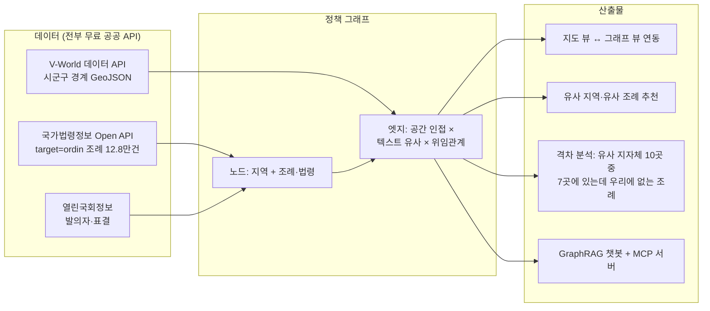

# 공간 정책 그래프 지도 — 전국 조례를 지도와 그래프로 잇다

> **한 줄 피치**: 전국 시군구의 조례·법령을 노드로, 공간 인접성과 정책 유사성을 엣지로 엮어,
> 지자체 실무자가 "우리와 비슷한 지역이 이미 만든 조례"를 구글링·전화 대신 그래프 탐색으로 찾게 하는 서비스.

- **가칭 후보** (최종은 팀 투표, [05_시스템_설계.md](./05_시스템_설계.md) 1.1절):
  **조례맵(JoryeMap)** · **입법나침반** · 폴리시그래프(PolicyGraph Korea) · 로컬로(LocalLaw) · K-조례 아틀라스
  — 1순위 권고는 **조례맵**(직관성) 또는 **입법나침반**(발표 스토리텔링용)
- **팀**: 국민대 학부생 3~4인 — 팀장·구현 / 아이디어·기획 / 분석·발표 (+1인 합류 미정)
- **목표**: 제8회 공간정보 활용·아이디어 경진대회 (국토교통부/공간정보산업진흥원) — **GeoAI 혁신 아이디어 부문 권고**
- **마감**: 공식 접수 **2026-09-18(금) 23:59**, 팀 내부 제출 마감 **09-16(수)**

---

## 1. 핵심 아이디어: 무엇을, 누구에게, 왜

### 무엇을

전국 시군구 단위의 **"공간 정책 그래프 지도"**. 법령·조례·규칙과 지역(시군구)을 그래프의 노드로 놓고,

1. **공간 인접성** (시군구 경계 접함, 동일 광역 소속)
2. **정책·법령 유사성** (조례 텍스트 임베딩 유사도, 상위법 위임관계)

두 종류의 엣지로 연결한다. **지도 뷰와 그래프 뷰를 연동**하고, 각 법령에는 제정·폐지 시점, 발의자, 정당별 표결, 기후·복지 등 카테고리 속성을 부여한다. 위에 GraphRAG 기반 챗봇/에이전트 인터페이스와 자체 MCP 서버를 얹는다.

### 누구에게

**지자체·지방의회 실무자.** 핵심 시나리오: 조례를 새로 만들어야 하는 실무자가 지금은 구글링과 타 지자체 전화로 선례를 찾는다. 이를 "우리와 비슷한 지역이 이미 만든 조례" 그래프 추천으로 대체해 시간과 비용을 아낀다. 킬러 기능은 **격차 분석** — "유사 지자체 10곳 중 7곳에 있는데 우리에게 없는 조례" 목록.

### 왜 (지금, 우리가)

- **완전한 공백 시장**: 국내에 조례×지도 교집합 서비스가 없다. ELIS는 텍스트 검색만, 국가법령정보센터 Lawbot은 자치법규 미포함, 리걸테크는 판례 중심. 해외(LawAtlas, CityHealth 등)도 조례 단위·그래프·지도·AI 4축을 모두 갖춘 사례가 없다 ([02](./02_선행사례_및_유사서비스_분석.md) 4~6절 비교표).
- **학술적 novelty**: 한국 조례 확산 연구(출산장려금 EHA 등)는 전부 수작업 데이터 수집이었다. 전국 조례 인용·유사도 그래프와 policy surveillance의 한국 전면 적용은 연구 공백 ([04](./04_선행연구_리뷰.md) 8절).
- **데이터 수급성 실증 완료**: 조례 본문(ordin)·법령체계도(lsStmd)·V-World 시군구 경계 GeoJSON 등 핵심 API를 실호출로 검증했다 — 1차 심사 배점의 35점(다양성15+수급성20)이 걸린 항목 ([03](./03_법령조례_체계와_데이터소스.md)).
- **레퍼런스 "합치되 초월"**: korea100(제도 해설 스키마·법령 검증 규율)과 klocal(235개 지자체 커버리지·비교 UX)을 결합하되, 둘 다 없는 **전역 그래프 + 지도 인터페이스 + AI/MCP** 3축을 얹는다. 주의: 두 사이트 모두 MCP 서버가 실제로는 없음을 실측으로 확정 — 팀 대화의 "두개 MCP 활용" 전제는 정정 필요 ([02](./02_선행사례_및_유사서비스_분석.md) 3절).

---

## 2. 문서 목차

읽는 순서 권장: 신규 팀원은 이 README → 01 → 05 → 06 순으로 보면 전체가 잡힌다.

| # | 문서 | 한 줄 설명 |
|---|---|---|
| 01 | [공모전 분석 및 수상 전략](./01_공모전_분석_및_수상전략.md) | 공모전 개요·심사기준 12항목 배점과 득점 논리, GeoAI 부문 권고 근거, 6·7회 수상작 20팀 전수 분석과 유사 선행작 5건 차별화, 제출 전 체크리스트 |
| 02 | [선행사례 및 유사 서비스 분석](./02_선행사례_및_유사서비스_분석.md) | korea100·klocal 상세 해부(MCP 부재 실측 확정), "합치되 초월"의 구체 정의, 국내 10종·해외 6종 유사 서비스 비교와 니치 명제 |
| 03 | [법령·조례 체계와 데이터 소스](./03_법령조례_체계와_데이터소스.md) | 법체계 위계와 조례의 법적 성격, 국가법령정보 Open API·ELIS·열린국회·V-World 등 소스별 실호출 검증 결과, 데이터 리스크 9종 |
| 04 | [선행연구 리뷰](./04_선행연구_리뷰.md) | 정책확산 이론·법령 인용 네트워크·GraphRAG·공간분석·policy surveillance 계보와 우리 모듈(M1~M5) 매핑, novelty 3대 공백 |
| 05 | [시스템 설계](./05_시스템_설계.md) | 가칭·페르소나, 그래프 스키마(노드 8종·엣지 7종), 파이프라인, 무서버 이중 저장 구조, 격차 분석 킬러 기능, MVP 범위 확정 |
| 06 | [실행계획 로드맵](./06_실행계획_로드맵.md) | 9.16 내부 마감 역산 5주 집필 일정(간트), 역할 분담, 리스크 10건 대응, 제출물 체크리스트, 1주 내 즉시 액션 |
| 07 | [레퍼런스 저장소 심층분석](./07_레퍼런스_저장소_심층분석.md) | korea100 저장소 해부(1인+Claude 체제, git 이력으로 MCP 진실 확정), 데이터 스키마 전수 문서화(canvas 9칸·process·verification), korea100studio 정체 정정, klocal 데이터 계층 정리, 공학 교훈 28건(가져올 10·변형 10·버릴 8) |
| 08 | [데이터 확보 전략](./08_데이터_확보_전략.md) | 확보 완료 자산 인벤토리, klocal 미러링 지양·원천(지방재정365 QWGJK API) 재수집 판정, 라이선스 3분류와 공모전 정합성, 조례↔예산 조인 설계, 작업 체크리스트 14항목 |
| 09 | [설계 고도화 v2](./09_설계_고도화_v2.md) | 05의 v2 증보판(델타 문서) — 조례 카드 card-v1 스키마 확정, 신규 킬러 기능 "조례 실효성 분석"(예산 연계), korea100studio식 콘텐츠 생산 파이프라인 이식, 서빙 아키텍처 확정, MCP 서버 joryemap-graph 스펙 |
| 10 | [시스템 구축 결과](./10_시스템_구축_결과.md) | **무키·무네트워크** 파이프라인 검증 — 스키마·수집기·파서·그래프·MCP 골격을 API 키 없이 시드 데이터로 완주한 기록 |
| 11 | [API키 발급 가이드](./11_API키_발급가이드.md) | 국가법령정보 OC · 열린국회 · V-World · 행안부 StanReginCd · 지방재정365 5종 키의 발급 절차·쿼터·`.env` 설정과 실호출 확인 방법 |
| 12 | [실데이터 수집 결과](./12_실데이터_수집결과.md) | 실제 키로 돌린 전수 수집 결과 — **조례 159,452건 · 예산 933,527행(2개년) · 조례↔예산 링크 93,964건**, 그래프 빌드·4종 분석·발표용 발견 5가지. 부록 AA(전수 수집) · AB(최종 통합 검증) |
| 13 | [신경망·GraphRAG 계층](./13_신경망_RAG_계층.md) | numpy 단독 구현 node2vec·metapath2vec·GraphSAGE 와 BM25+Dense 하이브리드 검색. **GraphSAGE 과평활 발견→JK-Net 수정→재측정**, RAG 그래프확장의 "무해하나 무익" 판정, MCP tool 12종 실호출 검증 |
| 14 | [법령그래프 표준 및 온톨로지](./14_법령그래프_표준_및_온톨로지.md) | 국제표준 7종(ELI·ECLI·Akoma Ntoso·LegalRuleML·CEN MetaLex·FRBR·LKIF-Core) **원문 확인** 후 우리 스키마와 대조해 격차 14건(G1~G14) 진단. 최대 격차는 FRBR Work/Expression 2축 부재, 고유 우위는 ELI에도 없는 **공간 승계축** |
| 15 | [법률 RAG 연구와 개선안](./15_법률RAG_연구와_개선안.md) | 법률 도메인 RAG 최신 연구 조사 + 우리 RAG가 BM25를 못 이기던 원인 규명. 근본 원인은 **"dense 채널이 dense가 아니었다"**(char n-gram TF, dense_dim=0 — BM25의 열화 복제본). cross-encoder 재랭킹 처방을 실측 검증 |
| 16 | [정책확산·그래프ML 방법론](./16_정책확산_그래프ML_방법론.md) | EHA·공간자기상관·확산네트워크와 이종그래프 GNN 선행연구 확인 + 우리 분석 모듈 4종 실행 검증. 공간자기상관은 **방어 가능**, 구 peer/확산 모듈은 **방어 불가**로 판정하고 대안 제시 |
| 17 | [링크 표본검증 보고서](./17_링크_표본검증_보고서.md) | 조례↔예산 링크 93,964건을 **층화표본 584건 수작업 판정**으로 검증. 전체 정밀도 64.9%, conf≥0.8 구간 93.2%. 오답 69건 7개 유형 전수분류 + confidence 캘리브레이션 |
| 18 | [시스템 완성도 종합](./18_시스템_완성도_종합.md) | **최종 통합 문서** — 전체 시스템을 (a)시스템공학 (b)학술 (c)정책활용 3관점에서 평가. 심사기준 12항목 대응표, 정직한 한계 목록, 발표용 핵심 메시지 5개 |

---

## 3. 핵심 사실 하이라이트 (공식 공고 기준, 2026-08-13 게시)

### 공모전 개요

| 항목 | 내용 |
|---|---|
| 대회명 | 제8회 공간정보 활용·아이디어 경진대회 (슬로건 "공간정보, AI를 만나다") |
| 주최/주관 | 국토교통부 / 공간정보산업진흥원 |
| 부문 (3개, 중복 지원 불가) | ① 공간정보 직접 활용 사례 ② 새로운 활용 모델 ③ **GeoAI 혁신 아이디어** ← 우리 권고 부문 |
| 참가 자격 | 개인·기업·기관 누구나, **최대 4인 팀**, 팀원 일부 중복 참여도 불가 |
| 접수 | 2026.8.18(화) ~ **9.18(금) 23:59**, 이메일 접수 (vworld@spacen.or.kr) |
| 제출 형식 | hwp 또는 문자인식 가능 PDF 원본만 (스캔본 불가), 파일명 `[공모분야-대표자 성명] 제목` |
| 시상 | 총 1,050만원 / **9팀** — 대상 3(부문별 1, 각 200만원, 장관상) · 최우수 3(각 100만원) · 우수 3(각 50만원) |

### 일정

| 일자 | 단계 | 비고 |
|---|---|---|
| ~9.16(수) | **팀 내부 제출 마감** | 공식 마감 이틀 전 버퍼 ([06](./06_실행계획_로드맵.md)) |
| 9.18(금) 23:59 | 공식 접수 마감 | |
| 9.29 | 1차 서면심사 | 수상 후보작 9건 선정 — **서식1+서식2 서류만으로 평가** |
| 9.30 ~ 10.9 | 공개검증 | 대국민 온라인 검증 10일 이상 |
| **10.22** | 2차 발표평가 | 진흥원 본원(안양) 인근. **중간고사와 겹칠 가능성 → PPT를 9월 중 선제작으로 흡수** |
| 11.5 | 시상 | K-GEO Festa |

### 심사 배점 (각 100점)

| 1차 서면심사 | 배점 | | 2차 발표평가 | 배점 |
|---|---|---|---|---|
| 데이터 수급성 | **20** | | 현실성 | **20** |
| 완성도 | **20** | | 파급성 | **20** |
| 독창성 | 15 | | 전달성 | 15 |
| 혁신성 | 15 | | 효과성 | 15 |
| 정확성 | 15 | | 지속성 | 15 |
| 데이터 다양성 | 15 | | 활용성 | 15 |

- **전략 핵심**: 데이터 관련 항목이 1차의 35점. 활용 데이터 표에 "실호출 검증 완료"를 명기하고, 아이디어 부문이라도 파일럿 실데이터 분석 1건을 반드시 수록 ([01](./01_공모전_분석_및_수상전략.md)).
- V-World 활용은 필수·가점 조항이 아님(공고 실측) — 다만 부문 정의·수급성·파급성 3중 근거로 자연스럽게 엮는다.
- 경계할 선행작: 7회 공공 우수상 연구개발특구진흥재단 "K-GeoP·KLIC 연계 AI"(6개 특구 한정) — **전국 226개 시군구 전체 + 관계·추천 그래프**라는 4축 차별화 논리로 방어 ([01](./01_공모전_분석_및_수상전략.md) 4절).
- 전국 단위 법령·조례 전체를 지도화한 수상작은 아직 없음 (추정, 6·7회 카드뉴스 전수 판독 기준).

### 이번 라운드 확정 사실 (2026-08-18, 레퍼런스 심층조사)

- **korea100 전체 데이터 로컬 확보 완료** [실측]: `external/korea100` 전체 클론 — 제도 JSON 578개(32.6MB), 커밋 481개. 스키마·검증 규율을 우리 조례 카드에 그대로 차용 가능 ([07](./07_레퍼런스_저장소_심층분석.md) 1~2절, [08](./08_데이터_확보_전략.md) 1절).
- **korea100studio 확보** [실측]: `external/korea100studio` 클론 — 파이프라인 전체가 아니라 렌더링+정량 품질게이트(관통=0 하드 게이트, 골든 베이스라인 회귀)를 Agent Skill로 추출한 패키지임을 정정 ([07](./07_레퍼런스_저장소_심층분석.md) 3절).
- **klocal 데이터 계층 역공학 완료**: 깃허브가 없어 라이브 사이트 역공학으로 manifest+조각 아키텍처를 파악. 미러링은 라이선스 무표시 리스크 + 원천(지방재정365) 상위 호환으로 **지양 판정** — 원천 재수집으로 대체 ([08](./08_데이터_확보_전략.md) 2~3절).
- **MCP 전제 재정정**: korea100 MCP는 main이 아닌 **미병합 브랜치**에 3개 제도만 공개하는 보수적 서버로 존재함을 git 이력으로 확정 — "라이브 서비스에는 미탑재"라는 기존 결론([02](./02_선행사례_및_유사서비스_분석.md) 3절)은 유지, klocal은 MCP 부재 그대로 ([07](./07_레퍼런스_저장소_심층분석.md) 1절).

### 구현 완료 시스템 규모 (2026-08-20 14시 실측 — 최종)

- **아이디어가 아니라 동작하는 시스템이 이미 있다** — DB **1.98 GB**에 조례 **159,452건**(전국 자치법규 메타 100%) · 조문 **357,979건** · 세출예산 **933,527행**(243지자체 × 2개년) · 조례↔예산 자동링크 **99,830건** · 위임관계 **50,735건** · 인용관계 **97,635건**을 적재해 **노드 1,114,320 / 엣지 595,688** 그래프를 빌드하고, 정적 번들 **291파일**로 export 한다.
- 그 위에 numpy 단독 구현 그래프 신경망 3종(임베딩 **661,297**행, 유사쌍 **1,893,530**행)과 BM25+Dense 하이브리드 + **cross-encoder 재랭킹** 검색을 얹어, 자체 **MCP 서버 tool 14종**으로 노출한다 — stdio 왕복 실호출 검증 완료, `pytest` **78 passed**.
- **조례 본문 전수 수집 진행 중**: 본문 확보 조례 **23,183건(14.5%)**, 초당 3.07건으로 잔여 136,368건 수집 중(ETA 약 12시간). 메타데이터는 이미 100%다.

### 학술적 근거 요약 (문서 14~17)

우리 시스템의 각 주장은 **원문 확인한 국제표준·선행연구**와 **자체 실측**으로 이중 방어된다. 특히 이번 라운드는 **우리 자신의 기능 3종을 반증**하고 고쳤다 — 이 정직성이 정확성 15점의 근거다.

| 영역 | 근거 | 검증 결과 |
|---|---|---|
| 식별체계 | ELI(OWL 원본 열람)·Akoma Ntoso NC v1.0·FRBR(IFLA 1998)·LegalRuleML(OASIS 2021) | 자치법규 **159,452건 100%**에 Work/Expression URI 부여. 시점질의 `in_force_at()` 동작 |
| 공간 군집 | Anselin(1995) LISA · Moran(1950) · Benjamini-Hochberg(1995) | 조례 수 **Moran's I=0.4333** (n=223, p=.001, z=9.32), BH-FDR 통과 LISA 9곳 |
| 확산 계량 | Berry&Berry(1990)·Shipan&Volden(2008)·Allison(1982)·Liang&Zeger(1986) | 로지스틱 확산곡선 **R² 중앙값 0.9923**. 단 **이웃 학습 가설은 기각** — EHA 20개 사양에서 이웃노출 FDR 통과 0개 |
| 검색 품질 | Rosa et al.(2021) "BM25 is a Strong Baseline" · Reuter et al.(2025) DRM | dense 채널이 **BM25의 열화 복제본**임을 진단 → cross-encoder 재랭킹으로 **P@1 0.5278→0.6667** |
| 링크 신뢰도 | 층화표본 + FPC + 역분산 결합 | 584건 수작업 판정. 전체 정밀도 **64.9%**, conf≥0.8 **93.2%** — 구간별로 정직하게 공시 |

상세는 [14](./14_법령그래프_표준_및_온톨로지.md) · [15](./15_법률RAG_연구와_개선안.md) · [16](./16_정책확산_그래프ML_방법론.md) · [17](./17_링크_표본검증_보고서.md), 종합 평가는 [18](./18_시스템_완성도_종합.md).

### MVP 범위 (확정)

- 카테고리 2개 — **출산장려금(C03)** × **반려동물(C11)** — × 전국 226개 시군구
- 저장소: Neo4j 대신 NetworkX + SQLite/parquet 분석 후 정적 JSON 서빙(무서버 이중 구조)
- 주의: 2026-07-01 전남광주통합특별시 출범으로 광역 17→16개, 자치법규 2,454건 정비 중 — 폐지 지자체 노드 보존 설계로 대응 ([05](./05_시스템_설계.md))

---

## 4. 즉시 다음 액션 5개

[06_실행계획_로드맵.md](./06_실행계획_로드맵.md) 7절에서 발췌. 담당은 해당 문서의 역할 분담표 참조.

| # | 기한 | 액션 | 왜 지금 |
|---|---|---|---|
| 1 | **8.19(수)** | "두개 MCP 활용" 전제 정정 팀 합의 — korea100 MCP는 미병합 브랜치에만 존재(3개 제도 공개, 라이브 미탑재), klocal은 MCP 없음([07](./07_레퍼런스_저장소_심층분석.md) 1절로 근거 보강 완료). "UX·콘텐츠 레퍼런스로 차용 + 우리가 MCP를 직접 만든다"로 스토리 전환 | 기획 방향의 전제 오류를 하루라도 빨리 바로잡아야 이후 문서가 흔들리지 않음 |
| 2 | **8.20(목)** | 공모 부문 택1 회의 — GeoAI 혁신 아이디어 부문 권고안 검토·확정 | 부문 간 중복 지원 불가라 되돌릴 수 없는 결정 |
| 3 | **8.21(금)** | 국가법령정보 Open API OC 키 발급 (팀원 각자 이메일 ID 기반) + 열린국회·V-World 키 신청 | 파일럿 실데이터 분석 1건이 1차 심사 35점 방어의 핵심 |
| 4 | **8.22(토)** | 4번째 팀원 합류 여부 확정 | 참가신청서 팀 구성 확정 + 역할 분담(3인 기본안 vs 4인 옵션) 분기점 |
| 5 | **8.24(월)** | 역대 수상작 유사작 정밀 조사 마무리 — 특히 7회 KLIC 연계작·정책 매칭작과의 차별화 논리 문장화 | 독창성 15점 방어 논리를 서식2에 그대로 이식하기 위함 |

---

## 부록: 저장소 규칙

- 모든 문서는 UTF-8 한국어 마크다운. 조사로 확정하지 못한 사실은 본문에 **"(확인 필요)"** / **"(추정)"** 을 명기하고, 실호출로 검증한 항목은 **[실측]** 으로 구분한다 (03 문서 규칙 준용).
- 각 문서 끝의 미확인 목록(02 부록, 04 9절, 05 부록 B, 06 전제표, 07 6절, 08 미확인 10건)은 제출 전 전수 해소가 원칙.
- `external/` 디렉토리는 레퍼런스 저장소 전체 클론 보관용: `external/korea100`(제도 JSON 578개, 32.6MB, 커밋 481개) · `external/korea100studio`(Agent Skill 기반 콘텐츠 생산 도구). klocal은 깃허브가 없어 클론 대상이 아니며 역공학 결과는 [07](./07_레퍼런스_저장소_심층분석.md) 4절·[08](./08_데이터_확보_전략.md) 참조.
- 국민대 중간고사 기간, 발표 형식·장소 상세, 기후변화사업단 기존 제안과의 중복 규정 저촉 여부는 (확인 필요) 상태다.
